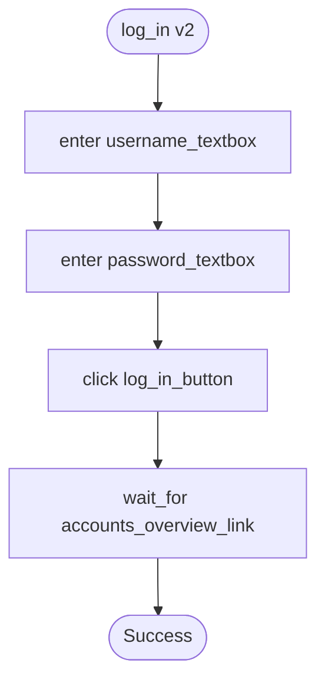
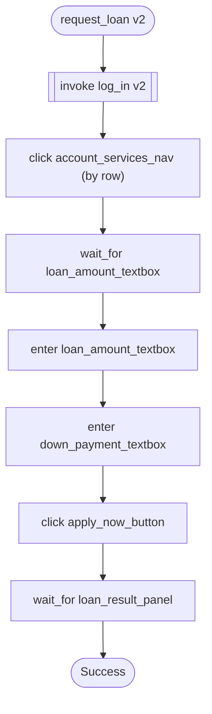
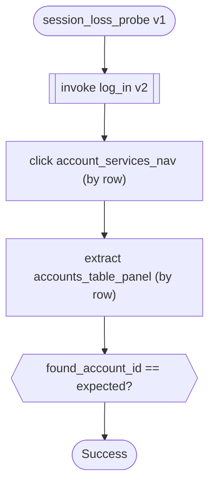

# Capabilities

Five capabilities, what each demonstrates, and a committed trace behind every
claim.

<table>
<tr><th width="26%">capability</th><th width="16%">artifacts</th><th width="16%">tenants</th><th>demonstrates</th></tr>
<tr><td><code>read_savings_balance</code> <b>v3</b><br/><sub><code>(account_id) → balance, account_type</code></sub><p>Look up an account by id and read its balance. The brief's own worked example.</p></td><td><ul><li><a href="https://github.com/borisdev/ai_computer_use/blob/main/artifacts/read_savings_balance.v3.approved.json">exported workflow</a></li><li><a href="https://github.com/borisdev/ai_computer_use/tree/main/evidence/runs/20260929T071443Z">evidence · A</a></li><li><a href="https://github.com/borisdev/ai_computer_use/tree/main/evidence/runs/20260929T192201Z">evidence · B</a></li><li><a href="#read_savings_balance-v3">mermaid diagram</a></li></ul></td><td><ul><li>✅ <b>A</b> baseline<br/><sub><code>Success</code> · 12 steps</sub></li><li>✅ <b>B</b> feature<br/><sub><code>Success</code> · 12 steps</sub></li></ul></td><td><ul><li><b>Panel extraction</b> — one model call for the whole table; the row is picked <b>in code</b></li><li><b>A checkpoint with teeth</b> — asserts <code>account_type = SAVINGS</code>, so CLEAN state fails instead of returning a stranger's balance</li><li><b>Business outcome</b> — account 99999 exits <b>0</b> — a fair negative answer, not a crash</li></ul></td></tr>
<tr><td><code>log_in</code> <b>v2</b><br/><sub><code>() → nothing</code></sub><p>Authenticate and reach the authenticated nav.</p></td><td><ul><li><a href="https://github.com/borisdev/ai_computer_use/blob/main/artifacts/log_in.v2.approved.json">exported workflow</a></li><li><a href="https://github.com/borisdev/ai_computer_use/tree/main/evidence/runs/20260929T192254Z">evidence · A</a></li><li><a href="https://github.com/borisdev/ai_computer_use/tree/main/evidence/runs/20260929T192301Z">evidence · B</a></li><li><a href="#log_in-v2">mermaid diagram</a></li></ul></td><td><ul><li>✅ <b>A</b> baseline<br/><sub><code>Success</code> · 4 steps</sub></li><li>✅ <b>B</b> feature<br/><sub><code>Success</code> · 4 steps</sub></li></ul></td><td><ul><li><b>Compositional capabilities</b> — invoked by three others in the <b>same browser session</b></li><li><b>Pinned versions</b> — a newer <code>log_in</code> is a validation error, never a silent substitution</li><li><b>Postconditions</b> — <code>establishes</code> is what recovery reads to know what restores a session</li></ul></td></tr>
<tr><td><code>log_in_discovered</code> <b>v1</b><br/><sub><code>() → account_id</code></sub><p>Authenticate and read back the account id. <b>The only artifact an LLM wrote.</b></p></td><td><ul><li><a href="https://github.com/borisdev/ai_computer_use/blob/main/artifacts/log_in_discovered.v1.approved.json">exported workflow</a></li><li><a href="https://github.com/borisdev/ai_computer_use/tree/main/evidence/runs/20260929T192220Z">evidence · A</a></li><li><a href="https://github.com/borisdev/ai_computer_use/tree/main/evidence/runs/20260929T192231Z">evidence · B</a></li><li><a href="#log_in_discovered-v1">mermaid diagram</a></li></ul></td><td><ul><li>✅ <b>A</b> baseline<br/><sub><code>Success</code> · 5 steps</sub></li><li>✅ <b>B</b> feature<br/><sub><code>Success</code> · 5 steps</sub></li></ul></td><td><ul><li><b>Discovery works</b> — a real LLM run — 3 steps, 4 model calls, 24s</li><li><b>Discovered beats authored</b> — <b>0 faults vs 3 and 8</b> against a real control map</li><li><b>Human handoff</b> — <code>requested → human_acted → returned</code>, on the same live session</li></ul></td></tr>
<tr><td><code>request_loan</code> <b>v2</b><br/><sub><code>(amount, down_payment) → nothing</code></sub><p>Apply for a loan of a given amount with a given down payment.</p></td><td><ul><li><a href="https://github.com/borisdev/ai_computer_use/blob/main/artifacts/request_loan.v2.approved.json">exported workflow</a></li><li><a href="https://github.com/borisdev/ai_computer_use/tree/main/evidence/runs/20260929T071538Z">evidence · A</a></li><li><a href="https://github.com/borisdev/ai_computer_use/tree/main/evidence/runs/20260929T192346Z">evidence · B</a></li><li><a href="#request_loan-v2">mermaid diagram</a></li></ul></td><td><ul><li>⚠️ <b>A</b> baseline<br/><sub><code>NeedsOperator</code> · over the $1,000 threshold</sub></li><li>⛔ <b>B</b> feature<br/><sub><code>Failed</code> · tenant does not permit it</sub></li></ul></td><td><ul><li><b>Value-dependent risk</b> — $25,000 stops, $500 does not, and <code>--confirm-risky</code> cannot buy past it</li><li><b>Irreversible means observed</b> — a schema rule: a <code>risky</code> step must be followed by a look</li><li><b>Tenant permissions</b> — refused <b>before a browser opens</b></li></ul></td></tr>
<tr><td><code>session_loss_probe</code> <b>v1</b><br/><sub><code>(account_id) → found_account_id</code></sub><p>Read an account, destroy its own session mid-flow, and carry on.</p></td><td><ul><li><a href="https://github.com/borisdev/ai_computer_use/blob/main/artifacts/session_loss_probe.v1.approved.json">exported workflow</a></li><li><a href="https://github.com/borisdev/ai_computer_use/tree/main/evidence/runs/20260929T071516Z">evidence · A</a></li><li><a href="https://github.com/borisdev/ai_computer_use/tree/main/evidence/runs/20260929T192329Z">evidence · B</a></li><li><a href="#session_loss_probe-v1">mermaid diagram</a></li></ul></td><td><ul><li>✅ <b>A</b> baseline<br/><sub><code>Success</code> + <code>recovered</code></sub></li><li>⛔ <b>B</b> feature<br/><sub><code>Failed</code> · tenant does not permit it</sub></li></ul></td><td><ul><li><b>Bounded recovery</b> — re-establishes a lost session <b>once per condition</b>, never in a loop</li><li><b>No `Recoverable` type</b> — a recovered condition is not a terminal state; <code>Success.recovered</code> names it</li></ul></td></tr>
</table>

✅ ran · ⚠️ stopped for a policy reason · ⛔ refused before a browser opened.

⚠️ **Why five, and why these five.** The brief (§2) asks for one goal driven end
to end — *"look up member 12345 and read their current savings balance"* — and
then for the SYSTEM around it. Each of these earns an outcome type or a
guardrail an **observed instance**; none was added because a bank needs the
feature. §7 says feature breadth is not rewarded.

---

## `read_savings_balance` v3

Look up an account by id and read its balance. The brief's own worked example.  `(account_id) → balance, account_type`

| tenant | outcome | evidence |
|---|---|---|
| `baseline` | ✅ `Success` · 12 steps | [trace](https://github.com/borisdev/ai_computer_use/tree/main/evidence/runs/20260929T071443Z) |
| `feature` | ✅ `Success` · 12 steps | [trace](https://github.com/borisdev/ai_computer_use/tree/main/evidence/runs/20260929T192201Z) |

[**exported workflow**](https://github.com/borisdev/ai_computer_use/blob/main/artifacts/read_savings_balance.v3.approved.json) — approved, version-pinned.

**Also:** [`BusinessOutcome` — account 99999](https://github.com/borisdev/ai_computer_use/tree/main/evidence/runs/20260929T071501Z)


## `log_in` v2

Authenticate and reach the authenticated nav.  `() → nothing`

| tenant | outcome | evidence |
|---|---|---|
| `baseline` | ✅ `Success` · 4 steps | [trace](https://github.com/borisdev/ai_computer_use/tree/main/evidence/runs/20260929T192254Z) |
| `feature` | ✅ `Success` · 4 steps | [trace](https://github.com/borisdev/ai_computer_use/tree/main/evidence/runs/20260929T192301Z) |

[**exported workflow**](https://github.com/borisdev/ai_computer_use/blob/main/artifacts/log_in.v2.approved.json) — approved, version-pinned.



## `log_in_discovered` v1

Authenticate and read back the account id. **The only artifact an LLM wrote.**  `() → account_id`

| tenant | outcome | evidence |
|---|---|---|
| `baseline` | ✅ `Success` · 5 steps | [trace](https://github.com/borisdev/ai_computer_use/tree/main/evidence/runs/20260929T192220Z) |
| `feature` | ✅ `Success` · 5 steps | [trace](https://github.com/borisdev/ai_computer_use/tree/main/evidence/runs/20260929T192231Z) |

[**exported workflow**](https://github.com/borisdev/ai_computer_use/blob/main/artifacts/log_in_discovered.v1.approved.json) — approved, version-pinned.

**Also:** [the discovery run that produced it](https://github.com/borisdev/ai_computer_use/tree/main/evidence/runs/20260926T022551Z) · [a full handoff](https://github.com/borisdev/ai_computer_use/tree/main/evidence/runs/20260929T051949Z)


## `request_loan` v2

Apply for a loan of a given amount with a given down payment.  `(amount, down_payment) → nothing`

| tenant | outcome | evidence |
|---|---|---|
| `baseline` | ⚠️ `NeedsOperator` · over the $1,000 threshold | [trace](https://github.com/borisdev/ai_computer_use/tree/main/evidence/runs/20260929T071538Z) |
| `feature` | ⛔ `Failed` · tenant does not permit it | [trace](https://github.com/borisdev/ai_computer_use/tree/main/evidence/runs/20260929T192346Z) |

[**exported workflow**](https://github.com/borisdev/ai_computer_use/blob/main/artifacts/request_loan.v2.approved.json) — approved, version-pinned.



## `session_loss_probe` v1

Read an account, destroy its own session mid-flow, and carry on.  `(account_id) → found_account_id`

| tenant | outcome | evidence |
|---|---|---|
| `baseline` | ✅ `Success` + `recovered` | [trace](https://github.com/borisdev/ai_computer_use/tree/main/evidence/runs/20260929T071516Z) |
| `feature` | ⛔ `Failed` · tenant does not permit it | [trace](https://github.com/borisdev/ai_computer_use/tree/main/evidence/runs/20260929T192329Z) |

[**exported workflow**](https://github.com/borisdev/ai_computer_use/blob/main/artifacts/session_loss_probe.v1.approved.json) — approved, version-pinned.


---

## What the tenants column shows

**Three of five replay identically on a tenant they were never recorded
against, with no change to the artifact.** That is §3.7's whole claim, and it
holds because an artifact names `(screen, control_id)` while the **control map**
holds the pixels — so the only tenant-specific thing in the system is a
directory of templates.

The two that stop are the more interesting result. They fail **at pre-flight,
before a browser opens**:

```
FAILED at pre-flight
  expected  session_loss_probe to be permitted for feature
  observed  this tenant permits ['log_in', 'log_in_discovered', …]
```

A tenant *refusing* a capability is not the same as a capability *not working*
there, and the outcome type says which — `Failed` with a policy reason, never a
locator that missed.

### Capabilities compose, and composition travels

`read_savings_balance` and `session_loss_probe` both `invoke log_in v2` — in the
**same browser session**, version pinned. On tenant B that invocation resolves
against **B's** control map. One artifact, two institutions, same pinned
dependency, and nothing in the capability knows which bank it is on.

```
  language      one vocabulary · one set of control roles · one set of verbs
      ↓
  capability    names (screen, control_id) — tenant-agnostic, versioned
      ↓
  control map   the pixels, keyed (app, tenant, screen) — the ONLY tenant layer
```

[`docs/layering.md`](docs/layering.md) draws that, and is honest that the third
layer is not yet what it should be: today a full map per tenant, where it wants
to be an app default plus only the controls that drift.

⚠️ **The honest limit.** Both images ship the stock unbranded UI. Put a
different brand on tenant B and **8 of 25 locators survive** — exactly the
image-anchored ones, while every text-anchored one drifts. `maps adopt` then
writes nothing and replay refuses at the precondition, which is the design
working. [REPORT §4](REPORT.md#4-heterogeneity--multi-tenant).

## Rationale, against the brief

Written down so the scope reads as chosen rather than as whatever fit.

| the brief asks for | what carries it |
|---|---|
| §2 *goal → LLM → record → replay → escalate → stay safe* | the five above, end to end |
| §3.2 *"both a human reviewer and a calling agent … what it does, what it needs, what it returns"* | this page, `interfaceai status`, and the generated diagrams |
| §3.3 *"distinguish expected business outcomes from recoverable conditions and hard failures"* | four outcome types, each with an observed instance above |
| §3.6 *"a human takes control of the live session"* | `log_in_discovered`'s handoff run |
| §3.7 *"reuse across institutions running the same app"* | the tenants column |
| §7 *"we do not reward feature breadth"* | **why there are five and not fifteen** |

⛔ **Still missing, and named rather than buried:** nothing here produces a
**validation error raised by the application**. §3.3 lists it. ParaBank raises
one for an insufficient-funds transfer, and no capability does transfers — so
that is the sixth capability worth building, and the only one that would add an
*outcome* rather than a feature.
