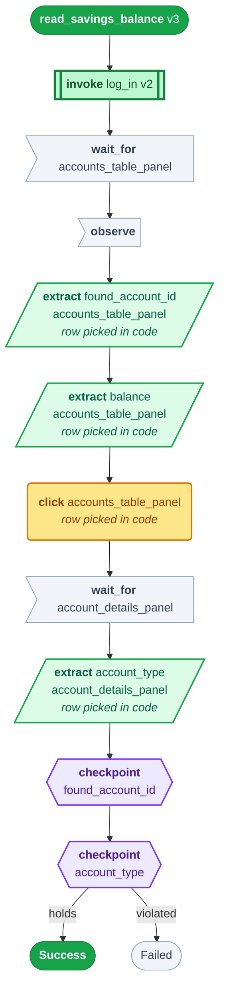
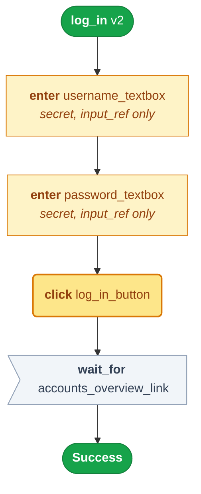
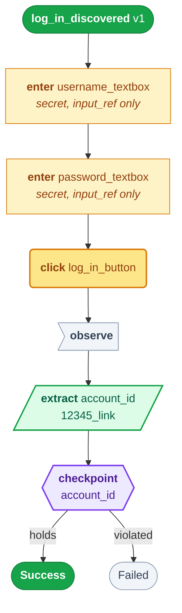
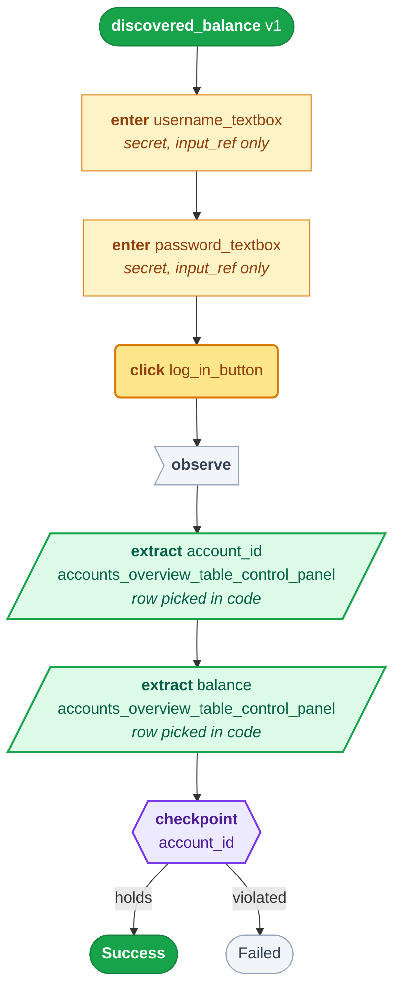
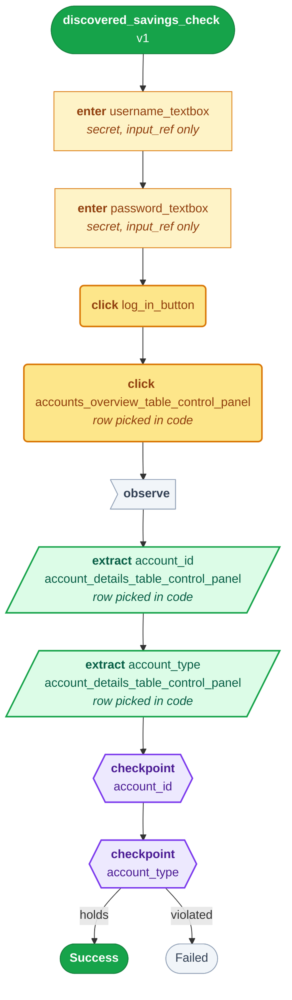
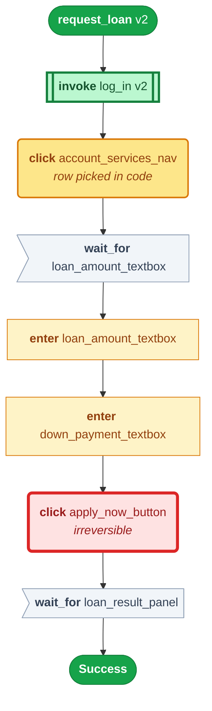
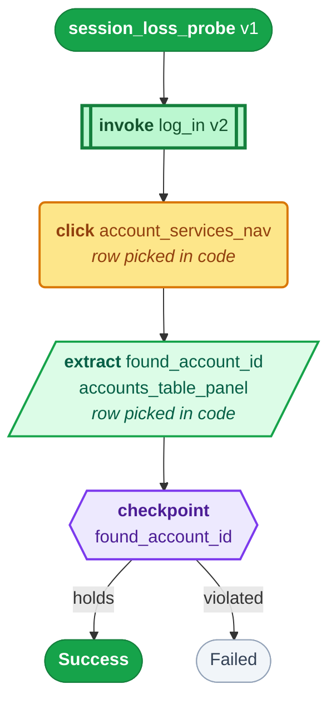

# Capabilities

Five capabilities, what each demonstrates, and a committed trace behind every
claim.

<table>
<tr><th width="24%">capability</th><th width="11%">origin</th><th width="16%">artifacts</th><th width="16%">tenants</th><th>demonstrates</th></tr>
<tr><td><code>read_savings_balance</code> <b>v3</b><br/><sub><code>(account_id) → balance, account_type</code></sub><p>Look up an account by id and read its balance. The brief's own worked example.</p></td><td>✍️ hand-authored<br/><sub>predates panel discovery</sub></td><td><ul><li><a href="https://github.com/borisdev/ai_computer_use/blob/main/artifacts/read_savings_balance.v3.approved.json">exported workflow</a></li><li><a href="https://github.com/borisdev/ai_computer_use/tree/main/evidence/runs/20260930T053738Z">evidence · A</a></li><li><a href="https://github.com/borisdev/ai_computer_use/tree/main/evidence/runs/20260930T053849Z">evidence · B</a></li><li><a href="#read_savings_balance-v3">mermaid diagram</a></li></ul></td><td><ul><li>✅ <b>A</b> baseline<br/><sub><code>Success</code> · 12 steps</sub></li><li>✅ <b>B</b> feature<br/><sub><code>Success</code> · 12 steps</sub></li></ul></td><td><ul><li><b>Panel extraction</b> — one model call for the whole table; the row is picked <b>in code</b></li><li><b>A checkpoint with teeth</b> — asserts <code>account_type = SAVINGS</code>, so CLEAN state fails instead of returning a stranger's balance</li><li><b>Business outcome</b> — account 99999 exits <b>0</b> — a fair negative answer, not a crash</li></ul></td></tr>
<tr><td><code>log_in</code> <b>v2</b><br/><sub><code>() → nothing</code></sub><p>Authenticate and reach the authenticated nav.</p></td><td>✍️ hand-authored</td><td><ul><li><a href="https://github.com/borisdev/ai_computer_use/blob/main/artifacts/log_in.v2.approved.json">exported workflow</a></li><li><a href="https://github.com/borisdev/ai_computer_use/tree/main/evidence/runs/20260930T174544Z">evidence · A</a></li><li><a href="https://github.com/borisdev/ai_computer_use/tree/main/evidence/runs/20260929T192301Z">evidence · B</a></li><li><a href="#log_in-v2">mermaid diagram</a></li></ul></td><td><ul><li>✅ <b>A</b> baseline<br/><sub><code>Success</code> · 4 steps</sub></li><li>✅ <b>B</b> feature<br/><sub><code>Success</code> · 4 steps</sub></li></ul></td><td><ul><li><b>Compositional capabilities</b> — invoked by three others in the <b>same browser session</b></li><li><b>Pinned versions</b> — a newer <code>log_in</code> is a validation error, never a silent substitution</li><li><b>Postconditions</b> — <code>establishes</code> is what recovery reads to know what restores a session</li></ul></td></tr>
<tr><td><code>log_in_discovered</code> <b>v1</b><br/><sub><code>() → account_id</code></sub><p>Authenticate and read back the account id. <b>The only artifact an LLM wrote.</b></p></td><td>🤖 <b>discovered</b><br/><sub>by a real LLM run</sub></td><td><ul><li><a href="https://github.com/borisdev/ai_computer_use/blob/main/artifacts/log_in_discovered.v1.approved.json">exported workflow</a></li><li><a href="https://github.com/borisdev/ai_computer_use/tree/main/evidence/runs/20260930T174552Z">evidence · A</a></li><li><a href="https://github.com/borisdev/ai_computer_use/tree/main/evidence/runs/20260929T192231Z">evidence · B</a></li><li><a href="#log_in_discovered-v1">mermaid diagram</a></li></ul></td><td><ul><li>✅ <b>A</b> baseline<br/><sub><code>Success</code> · 5 steps</sub></li><li>✅ <b>B</b> feature<br/><sub><code>Success</code> · 5 steps</sub></li></ul></td><td><ul><li><b>Discovery works</b> — a real LLM run — 3 steps, 4 model calls, 24s</li><li><b>Discovered beats authored</b> — <b>0 faults on first emission</b>; the first hand-written drafts had 3 and 8, naming a screen that does not exist</li><li><b>Human handoff</b> — <code>requested → human_acted → returned</code>, on the same live session</li></ul></td></tr>
<tr><td><code>discovered_balance</code> <b>v1</b><br/><sub><code>(account_id) → account_id, balance</code></sub><p>Read one account's balance out of the accounts table. <b>Discovered including its <code>TABLE_CONTROL_PANEL</code></b> — the gap #6 was open on.</p></td><td>🤖 <b>discovered</b><br/><sub>panel and all</sub></td><td><ul><li><a href="https://github.com/borisdev/ai_computer_use/blob/main/artifacts/discovered_balance.v1.approved.json">exported workflow</a></li><li><a href="https://github.com/borisdev/ai_computer_use/tree/main/evidence/runs/20260930T035056Z">evidence · A</a></li><li><a href="https://github.com/borisdev/ai_computer_use/tree/main/evidence/runs/20260930T035110Z">evidence · B</a></li><li><a href="#discovered_balance-v1">mermaid diagram</a></li></ul></td><td><ul><li>✅ <b>A</b> baseline<br/><sub><code>Success</code> · 6 steps</sub></li><li>✅ <b>B</b> feature<br/><sub><code>Success</code> · 6 steps</sub></li></ul></td><td><ul><li><b>A discovered panel</b> — geometry measured the table — <b>11 rows, 28px pitch, autocorrelation 0.899</b> — and no pixel was asked of a model</li><li><b>The row by arithmetic</b> — <code>row_key=account_id</code>, <code>field=balance</code>; the whole table is read in one call and the row picked <b>in code</b></li><li><b>Cross-tenant, discovered</b> — the heading it anchored on matches a <b>different build</b> of ParaBank, unchanged</li></ul></td></tr>
<tr><td><code>discovered_savings_check</code> <b>v1</b><br/><sub><code>(account_id) → account_id, account_type</code></sub><p>Confirm an account IS a savings account, by opening it from the table and reading its type off the detail page. <b>The same shape as <code>read_savings_balance</code>, discovered</b> — two panels and a drilldown between them.</p></td><td>🤖 <b>discovered</b><br/><sub>the brief's own example</sub></td><td><ul><li><a href="https://github.com/borisdev/ai_computer_use/blob/main/artifacts/discovered_savings_check.v1.approved.json">exported workflow</a></li><li><a href="https://github.com/borisdev/ai_computer_use/tree/main/evidence/runs/20260930T182723Z">evidence · A</a></li><li><a href="https://github.com/borisdev/ai_computer_use/tree/main/evidence/runs/20260930T182743Z">evidence · B</a></li><li><a href="#discovered_savings_check-v1">mermaid diagram</a></li></ul></td><td><ul><li>✅ <b>A</b> baseline<br/><sub><code>Success</code> · 7 steps</sub></li><li>✅ <b>B</b> feature<br/><sub><code>Success</code> · 7 steps</sub></li></ul></td><td><ul><li><b>A drilldown, discovered</b> — <code>click</code> on a panel with <code>row_key=account_id</code> — the row's position comes from the panel read and the measured pitch, never from pointing at it</li><li><b>Two discovered panels</b> — a TABLE on the overview and a LABEL/VALUE block on the detail page; the second shape was invisible to the read pass until it was named</li><li><b>A checkpoint with teeth, derived</b> — <code>account_type == SAVINGS</code> was inferred from the run. It is an assertion, so the NAME says so — a capability promising to read any type must not fail on a checking account (Copilot, #14). <code>interfaceai env break</code> makes it fail with <b>observed CHECKING</b></li></ul></td></tr>
<tr><td><code>request_loan</code> <b>v2</b><br/><sub><code>(amount, down_payment) → nothing</code></sub><p>Apply for a loan of a given amount with a given down payment.</p></td><td>✍️ hand-authored<br/><sub>predates panel discovery</sub></td><td><ul><li><a href="https://github.com/borisdev/ai_computer_use/blob/main/artifacts/request_loan.v2.approved.json">exported workflow</a></li><li><a href="https://github.com/borisdev/ai_computer_use/tree/main/evidence/runs/20260930T053834Z">evidence · A</a></li><li><a href="https://github.com/borisdev/ai_computer_use/tree/main/evidence/runs/20260929T192346Z">evidence · B</a></li><li><a href="#request_loan-v2">mermaid diagram</a></li></ul></td><td><ul><li>⚠️ <b>A</b> baseline<br/><sub><code>NeedsOperator</code> · over the $1,000 threshold</sub></li><li>⛔ <b>B</b> feature<br/><sub><code>Failed</code> · tenant does not permit it</sub></li></ul></td><td><ul><li><b>Value-dependent risk</b> — $25,000 stops, $500 does not, and <code>--confirm-risky</code> cannot buy past it</li><li><b>Irreversible means observed</b> — a schema rule: a <code>risky</code> step must be followed by a look</li><li><b>Tenant permissions</b> — refused <b>before a browser opens</b></li></ul></td></tr>
<tr><td><code>session_loss_probe</code> <b>v1</b><br/><sub><code>(account_id) → found_account_id</code></sub><p>Read an account, destroy its own session mid-flow, and carry on.</p></td><td>✍️ hand-authored<br/><sub>predates panel discovery</sub></td><td><ul><li><a href="https://github.com/borisdev/ai_computer_use/blob/main/artifacts/session_loss_probe.v1.approved.json">exported workflow</a></li><li><a href="https://github.com/borisdev/ai_computer_use/tree/main/evidence/runs/20260930T053811Z">evidence · A</a></li><li><a href="https://github.com/borisdev/ai_computer_use/tree/main/evidence/runs/20260929T192329Z">evidence · B</a></li><li><a href="#session_loss_probe-v1">mermaid diagram</a></li></ul></td><td><ul><li>✅ <b>A</b> baseline<br/><sub><code>Success</code> + <code>recovered</code></sub></li><li>⛔ <b>B</b> feature<br/><sub><code>Failed</code> · tenant does not permit it</sub></li></ul></td><td><ul><li><b>Bounded recovery</b> — re-establishes a lost session <b>once per condition</b>, never in a loop</li><li><b>No `Recoverable` type</b> — a recovered condition is not a terminal state; <code>Success.recovered</code> names it</li></ul></td></tr>
</table>

✅ ran · ⚠️ stopped for a policy reason · ⛔ refused before a browser opened.

⚠️ **Why these, and no more.** The brief (§2) asks for one goal driven end to
end — *"look up member 12345 and read their current savings balance"* — and then
for the SYSTEM around it. Each one here earns an outcome type or a guardrail an
**observed instance**; none was added because a bank needs the feature. §7 says
feature breadth is not rewarded.

⚠️ Two of them answer the SAME goal, and that is the point of the pair:
`read_savings_balance` was written by a person and `discovered_balance` was
discovered, panel included. Compare them rather than counting them — the
authored one checks `account_type` on the detail page, which discovery does not
reach, and the discovered one names nothing it did not see.

---

## `read_savings_balance` v3

Look up an account by id and read its balance. The brief's own worked example.  `(account_id) → balance, account_type`

| tenant | outcome | evidence |
|---|---|---|
| `baseline` | ✅ `Success` · 12 steps | [trace](https://github.com/borisdev/ai_computer_use/tree/main/evidence/runs/20260930T053738Z) |
| `feature` | ✅ `Success` · 12 steps | [trace](https://github.com/borisdev/ai_computer_use/tree/main/evidence/runs/20260930T053849Z) |

**Run it:**

```bash
uv run interfaceai replay -c read_savings_balance --param account_id=13344
```

[**exported workflow**](https://github.com/borisdev/ai_computer_use/blob/main/artifacts/read_savings_balance.v3.approved.json) — approved, version-pinned.

**Also:** [`BusinessOutcome` — account 99999](https://github.com/borisdev/ai_computer_use/tree/main/evidence/runs/20260930T053757Z)



## `log_in` v2

Authenticate and reach the authenticated nav.  `() → nothing`

| tenant | outcome | evidence |
|---|---|---|
| `baseline` | ✅ `Success` · 4 steps | [trace](https://github.com/borisdev/ai_computer_use/tree/main/evidence/runs/20260930T174544Z) |
| `feature` | ✅ `Success` · 4 steps | [trace](https://github.com/borisdev/ai_computer_use/tree/main/evidence/runs/20260929T192301Z) |

**Run it:**

```bash
uv run interfaceai replay -c log_in 
```

[**exported workflow**](https://github.com/borisdev/ai_computer_use/blob/main/artifacts/log_in.v2.approved.json) — approved, version-pinned.



## `log_in_discovered` v1

Authenticate and read back the account id. **The only artifact an LLM wrote.**  `() → account_id`

| tenant | outcome | evidence |
|---|---|---|
| `baseline` | ✅ `Success` · 5 steps | [trace](https://github.com/borisdev/ai_computer_use/tree/main/evidence/runs/20260930T174552Z) |
| `feature` | ✅ `Success` · 5 steps | [trace](https://github.com/borisdev/ai_computer_use/tree/main/evidence/runs/20260929T192231Z) |

**Run it:**

```bash
uv run interfaceai replay -c log_in_discovered 
```

[**exported workflow**](https://github.com/borisdev/ai_computer_use/blob/main/artifacts/log_in_discovered.v1.approved.json) — approved, version-pinned.

**Also:** [the discovery run that produced it](https://github.com/borisdev/ai_computer_use/tree/main/evidence/runs/20260926T022551Z) · [a full handoff](https://github.com/borisdev/ai_computer_use/tree/main/evidence/runs/20260930T053709Z)



## `discovered_balance` v1

Read one account's balance out of the accounts table. **Discovered including its `TABLE_CONTROL_PANEL`** — the gap #6 was open on.  `(account_id) → account_id, balance`

| tenant | outcome | evidence |
|---|---|---|
| `baseline` | ✅ `Success` · 6 steps | [trace](https://github.com/borisdev/ai_computer_use/tree/main/evidence/runs/20260930T035056Z) |
| `feature` | ✅ `Success` · 6 steps | [trace](https://github.com/borisdev/ai_computer_use/tree/main/evidence/runs/20260930T035110Z) |

**Run it:**

```bash
uv run interfaceai replay -c discovered_balance --param account_id=13344
```

[**exported workflow**](https://github.com/borisdev/ai_computer_use/blob/main/artifacts/discovered_balance.v1.approved.json) — approved, version-pinned.

**Also:** [the discovery run that produced it](https://github.com/borisdev/ai_computer_use/tree/main/evidence/runs/20260929T232850Z)



## `discovered_savings_check` v1

Confirm an account IS a savings account, by opening it from the table and reading its type off the detail page. **The same shape as `read_savings_balance`, discovered** — two panels and a drilldown between them.  `(account_id) → account_id, account_type`

| tenant | outcome | evidence |
|---|---|---|
| `baseline` | ✅ `Success` · 7 steps | [trace](https://github.com/borisdev/ai_computer_use/tree/main/evidence/runs/20260930T182723Z) |
| `feature` | ✅ `Success` · 7 steps | [trace](https://github.com/borisdev/ai_computer_use/tree/main/evidence/runs/20260930T182743Z) |

**Run it:**

```bash
uv run interfaceai replay -c discovered_savings_check --param account_id=13344
```

[**exported workflow**](https://github.com/borisdev/ai_computer_use/blob/main/artifacts/discovered_savings_check.v1.approved.json) — approved, version-pinned.

**Also:** [the discovery run that produced it](https://github.com/borisdev/ai_computer_use/tree/main/evidence/runs/20260930T182155Z) · [the checkpoint firing on a changed record](https://github.com/borisdev/ai_computer_use/tree/main/evidence/runs/20260930T182806Z)



## `request_loan` v2

Apply for a loan of a given amount with a given down payment.  `(amount, down_payment) → nothing`

| tenant | outcome | evidence |
|---|---|---|
| `baseline` | ⚠️ `NeedsOperator` · over the $1,000 threshold | [trace](https://github.com/borisdev/ai_computer_use/tree/main/evidence/runs/20260930T053834Z) |
| `feature` | ⛔ `Failed` · tenant does not permit it | [trace](https://github.com/borisdev/ai_computer_use/tree/main/evidence/runs/20260929T192346Z) |

**Run it:**

```bash
uv run interfaceai replay -c request_loan --param amount=25000 --param down_payment=5000 --confirm-risky
```

[**exported workflow**](https://github.com/borisdev/ai_computer_use/blob/main/artifacts/request_loan.v2.approved.json) — approved, version-pinned.



## `session_loss_probe` v1

Read an account, destroy its own session mid-flow, and carry on.  `(account_id) → found_account_id`

| tenant | outcome | evidence |
|---|---|---|
| `baseline` | ✅ `Success` + `recovered` | [trace](https://github.com/borisdev/ai_computer_use/tree/main/evidence/runs/20260930T053811Z) |
| `feature` | ⛔ `Failed` · tenant does not permit it | [trace](https://github.com/borisdev/ai_computer_use/tree/main/evidence/runs/20260929T192329Z) |

**Run it:**

```bash
uv run interfaceai replay -c session_loss_probe --param account_id=13344
```

[**exported workflow**](https://github.com/borisdev/ai_computer_use/blob/main/artifacts/session_loss_probe.v1.approved.json) — approved, version-pinned.



---

## ⛔ THREE were discovered, and the reason the others were not is GONE

`log_in_discovered`, `discovered_balance` and `discovered_savings_check` came out
of real LLM runs. The other four were **written by hand** in `capabilities.py`.

⭐ **`discovered_savings_check` is the brief's own worked example, discovered.**
Two panels and a drilldown between them: open account 13344 from the accounts
table by `row_key`, then read `Account Type` out of a label/value block on the
detail page. It is the same shape as the hand-written `read_savings_balance` v3,
including the `account_type == SAVINGS` checkpoint — which discovery inferred from
the run, and which fails with **observed `CHECKING`** after `interfaceai env
break`. That is the honest state and
worth being precise about, because the brief's through-line is *"the model
discovers, the artifact becomes a reusable capability."*

⛔ **This section said "Only ONE of the five, and the reason is causal" until
2026-09-29,** the reason being that *"discovery cannot emit a
`TABLE_CONTROL_PANEL`"* — with a coarse prompt told to ignore static text and
layout, so it *"structurally cannot see the thing replay depends on"*. True when
written, and **closed** by [#6](https://github.com/borisdev/ai_computer_use/issues/6):
a second pass reads REPEATED STRUCTURES off the clean screenshot, and pure
geometry measures them — pitch by ink runs confirmed against
`find_row_rhythm`, phase and row count from the runs, and not one pixel asked of
a model.

`discovered_balance` is the artifact that closes the loop, and it is worth reading
as one line: **discovered → approved → replayed on both tenants**, reading a named
row out of an eleven-row table whose shape nobody told it.

⚠️ **Every region this repo measured by hand is now proposed AND measured**,
including the two that were missed at first:

```
accounts table        11 rows, pitch 28px, autocorrelation 0.899   proposed, measured, USED
account detail         4 rows, pitch 23px, 0.686                   proposed, measured, USED
account-services nav   8 rows, pitch 24px, 0.797                  proposed, measured
loan result            3 rows, pitch 23px                          proposed, measured
ATM / online services  4 and 3 rows, pitch 20px                   proposed, measured
empty transactions    refused: "no column below the heading repeats"
```

⛔ **And the reason the last two were missed is worth more than the fix.** The
prompt asked for *"a region of three or more near-identical rows — a results
table, an account list, a label/value block, a menu of links"*, which reads as
complete. Measured, three runs each: it found the account-detail block **0 of 3**
times and the loan result **0 of 3**. Describing the LABEL/VALUE shape in its own
right — *"one record's own fields, one per row, each row reading `Field Name:
value` … easy to overlook because it is not a grid"* — found both **3 of 3**, and
lost nothing. The model was not failing to see them; it was answering a question
that did not ask for them.

The four hand-measured panels stay in the store beside the discovered ones because
four artifacts name their ids, not because a hand is still required.

⚠️ **The origin column said `needs a panel` under the hand-authored three until
2026-09-30, and that had become a false REASON rather than a stale label.** They
are hand-written because they predate panel discovery. `read_savings_balance` in
particular is a Python literal in `capabilities.py`: its approved artifact is
byte-identical to an export of that declaration, and its v1 named `global_nav` —
a screen with no control map — which is how a hand-written artifact carries 8
faults and a recorded one carries 0.

Everything downstream of the artifact — validation, approval, replay,
composition, the guardrails — already treats both origins identically, which is
why both discovered capabilities replay on both tenants alongside the rest.

⚠️ **And the comparison favours the machine, precisely.** `interfaceai
capability check` resolves every control an artifact names against the control
maps it would replay against:

```
log_in.v1.draft                 3 faults   precondition + steps name a screen
read_savings_balance.v1.draft   8 faults   called 'global_nav' — which has no map
log_in_discovered.v1            0 faults   first emission, no correction
```

A fault is a step naming a control **that does not exist** — I invented a screen
and wrote six steps against it. The current hand-written artifacts are at 0 too,
because they were corrected; the point is which needed correcting. **A
hand-written artifact can name anything. A discovered one can only name what it
actually saw.**

## What the tenants column shows

**Three of five replay identically on a tenant they were never recorded
against, with no change to the artifact.** That is §3.7's whole claim, and it
holds because an artifact names `(screen, control_id)` while the **control map**
holds the pixels — so the only tenant-specific thing in the system is a
directory of templates.

The two that stop fail **at pre-flight, before a browser opens**:

```
FAILED at pre-flight
  expected  session_loss_probe to be permitted for feature
  observed  this tenant permits ['log_in', 'log_in_discovered', …]
```

A tenant *refusing* a capability is not the same as a capability *not working*
there, and the outcome type says which — `Failed` with a policy reason, never a
locator that missed.

### Capabilities compose, and composition travels

`read_savings_balance` and `session_loss_probe` both `invoke log_in v2` — in the
**same browser session**, version pinned. On tenant B that invocation resolves
against **B's** control map. One artifact, two institutions, same pinned
dependency, and nothing in the capability knows which bank it is on.

That is why an invoked capability is drawn in the **same green as the
terminus**: it is not a step, it is a whole capability with its own steps and
its own checkpoint, running inside this one.

```
  language      value · control · capability · outcome        docs/language.md
      ↓
  capability    names (screen, control_id) — tenant-agnostic, versioned
      ↓
  control map   the pixels, keyed (app, tenant, screen) — the ONLY tenant layer
```

[`docs/layering.md`](docs/layering.md) draws that and is honest that the third
layer is not yet what it should be: today a full map per tenant, where it wants
to be an app default plus only the controls that drift.

⚠️ **The honest limit.** Both images ship the stock unbranded UI. Put a
different brand on tenant B and **8 of 25 locators survive** — exactly the
image-anchored ones, while every text-anchored one drifts. `maps adopt` then
writes nothing and replay refuses at the precondition, which is the design
working. [REPORT §4](REPORT.md#4-heterogeneity--multi-tenant).

## Rationale, against the brief

Written down so the scope reads as chosen rather than as whatever fit.

| the brief asks for | what carries it |
|---|---|
| §2 *goal → LLM → record → replay → escalate → stay safe* | the five above, end to end |
| §3.2 *"both a human reviewer and a calling agent … what it does, what it needs, what it returns"* | this page, `interfaceai status`, and the generated diagrams |
| §3.3 *"distinguish expected business outcomes from recoverable conditions and hard failures"* | four outcome types, each with an observed instance above |
| §3.6 *"a human takes control of the live session"* | `log_in_discovered`'s handoff run |
| §3.7 *"reuse across institutions running the same app"* | the tenants column |
| §7 *"we do not reward feature breadth"* | **why there are five and not fifteen** |

⛔ **Still missing, and named rather than buried:** nothing here produces a
**validation error raised by the application**. §3.3 lists it. ParaBank raises
one for an insufficient-funds transfer, and no capability does transfers — so
that is the sixth capability worth building, and the only one that would add an
*outcome* rather than a feature.
