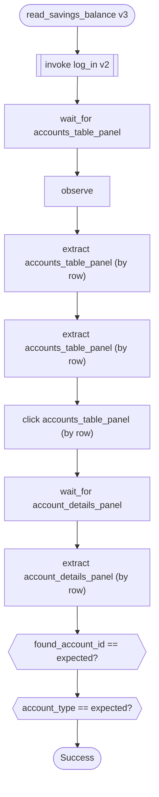
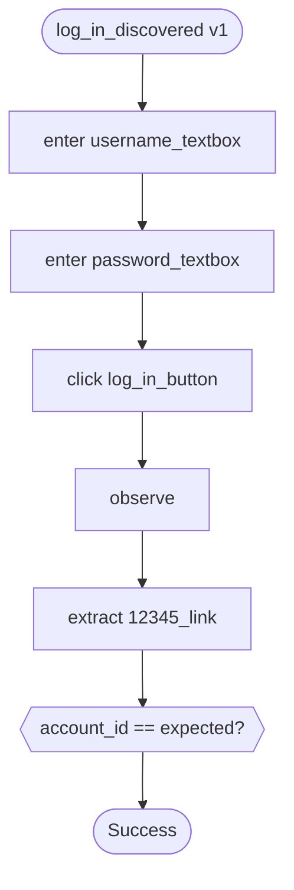

# Capabilities

Five capabilities, what each demonstrates, and the evidence for every claim.

| capability | what it does | artifact · evidence · diagram | A / B | what it proves **beyond itself** |
|---|---|---|---|---|
| **`read_savings_balance`** v3<br/>`(account_id) → found_account_id, balance, account_type` | Look up an account by id and read its balance. The brief's own worked example. | [workflow](https://github.com/borisdev/ai_computer_use/blob/main/artifacts/read_savings_balance.v3.approved.json) · [baseline](https://github.com/borisdev/ai_computer_use/tree/main/evidence/runs/20260929T071443Z) [feature](https://github.com/borisdev/ai_computer_use/tree/main/evidence/runs/20260929T192201Z) · [diagram](#read_savings_balance-v3) | ✅ ✅ | **Panel extraction** — one model call for the whole table, row picked *in code*. **A checkpoint with teeth**: returns `account_type` and asserts `SAVINGS`, so ParaBank's CLEAN state (13344 survives as `CHECKING $5,022.93`) fails rather than handing back a stranger's balance. Also the `BusinessOutcome` path — account 99999 exits **0**. |
| **`log_in`** v2<br/>`() → nothing` | Authenticate and reach the authenticated nav. | [workflow](https://github.com/borisdev/ai_computer_use/blob/main/artifacts/log_in.v2.approved.json) · [baseline](https://github.com/borisdev/ai_computer_use/tree/main/evidence/runs/20260929T192254Z) [feature](https://github.com/borisdev/ai_computer_use/tree/main/evidence/runs/20260929T192301Z) · [diagram](#log_in-v2) | ✅ ✅ | **Composition.** Invoked by three other capabilities *in the same browser session*, version pinned — a newer `log_in` is a validation error, never a silent substitution. **`establishes`** names the postcondition recovery uses to know what puts a lost session back. |
| **`log_in_discovered`** v1<br/>`() → account_id` | Authenticate and read back the account id. **The only artifact an LLM wrote.** | [workflow](https://github.com/borisdev/ai_computer_use/blob/main/artifacts/log_in_discovered.v1.approved.json) · [baseline](https://github.com/borisdev/ai_computer_use/tree/main/evidence/runs/20260929T192220Z) [feature](https://github.com/borisdev/ai_computer_use/tree/main/evidence/runs/20260929T192231Z) · [diagram](#log_in_discovered-v1) | ✅ ✅ | **That discovery works** — 3 steps, 4 model calls, 24s. Measured against hand-written artifacts: **0 faults vs 3 and 8** against a real control map. Also the **handoff** subject. |
| **`request_loan`** v2<br/>`(amount, down_payment) → nothing` | Apply for a loan of a given amount with a given down payment. | [workflow](https://github.com/borisdev/ai_computer_use/blob/main/artifacts/request_loan.v2.approved.json) · [baseline](https://github.com/borisdev/ai_computer_use/tree/main/evidence/runs/20260929T071538Z) [feature](https://github.com/borisdev/ai_computer_use/tree/main/evidence/runs/20260929T192346Z) · [diagram](#request_loan-v2) | ⚠️ ⛔ | **Value-dependent risk** — $25,000 stops, $500 does not, and `--confirm-risky` cannot buy past it. **Irreversibility as a schema rule**: a `risky` step must be followed by an observation, which is why the last step is `wait_for loan_result_panel`. **Tenant permissions**, refused before a browser opens. |
| **`session_loss_probe`** v1<br/>`(account_id) → found_account_id` | Read an account, destroy its own session mid-flow, and carry on. | [workflow](https://github.com/borisdev/ai_computer_use/blob/main/artifacts/session_loss_probe.v1.approved.json) · [baseline](https://github.com/borisdev/ai_computer_use/tree/main/evidence/runs/20260929T071516Z) [feature](https://github.com/borisdev/ai_computer_use/tree/main/evidence/runs/20260929T192329Z) · [diagram](#session_loss_probe-v1) | ✅ ⛔ | **Recovery, and why there is no `Recoverable` outcome.** Comes back `Success` carrying `recovered accounts_overview_link gone`, bounded to **once per condition**. A recovered condition is not a terminal state. |

`A` = tenant **baseline**, `B` = tenant **feature**. ✅ ran · ⚠️ stopped for a
policy reason · ⛔ refused before a browser opened. Every cell links to a
committed trace.

⚠️ **Why five, and why these five.** The brief (§2) asks for one goal driven end
to end — *"look up member 12345 and read their current savings balance"* — and
then for the SYSTEM around it. These five exist because each earns an outcome
type or a guardrail an **observed instance**, not because a bank needs five
features. §7 says feature breadth is not rewarded; five more banking flows
would have added breadth and no evidence.

---

## `read_savings_balance` v3

Look up an account by id and read its balance. The brief's own worked example.  `(account_id) → found_account_id, balance, account_type`

| tenant | outcome | evidence |
|---|---|---|
| `baseline` | ✅ `Success` · 12 steps | [trace](https://github.com/borisdev/ai_computer_use/tree/main/evidence/runs/20260929T071443Z) |
| `feature` | ✅ `Success` · 12 steps | [trace](https://github.com/borisdev/ai_computer_use/tree/main/evidence/runs/20260929T192201Z) |

[**exported workflow**](https://github.com/borisdev/ai_computer_use/blob/main/artifacts/read_savings_balance.v3.approved.json) — approved, version-pinned.

**Also:**

- `BusinessOutcome` — account 99999 — [trace](https://github.com/borisdev/ai_computer_use/tree/main/evidence/runs/20260929T071501Z)




## `log_in` v2

Authenticate and reach the authenticated nav.  `() → nothing`

| tenant | outcome | evidence |
|---|---|---|
| `baseline` | ✅ `Success` · 4 steps | [trace](https://github.com/borisdev/ai_computer_use/tree/main/evidence/runs/20260929T192254Z) |
| `feature` | ✅ `Success` · 4 steps | [trace](https://github.com/borisdev/ai_computer_use/tree/main/evidence/runs/20260929T192301Z) |

[**exported workflow**](https://github.com/borisdev/ai_computer_use/blob/main/artifacts/log_in.v2.approved.json) — approved, version-pinned.


## `log_in_discovered` v1

Authenticate and read back the account id. **The only artifact an LLM wrote.**  `() → account_id`

| tenant | outcome | evidence |
|---|---|---|
| `baseline` | ✅ `Success` · 5 steps | [trace](https://github.com/borisdev/ai_computer_use/tree/main/evidence/runs/20260929T192220Z) |
| `feature` | ✅ `Success` · 5 steps | [trace](https://github.com/borisdev/ai_computer_use/tree/main/evidence/runs/20260929T192231Z) |

[**exported workflow**](https://github.com/borisdev/ai_computer_use/blob/main/artifacts/log_in_discovered.v1.approved.json) — approved, version-pinned.

**Also:**

- the discovery run that produced it — [trace](https://github.com/borisdev/ai_computer_use/tree/main/evidence/runs/20260926T022551Z)
- a full handoff — `requested → human_acted → returned` — [trace](https://github.com/borisdev/ai_computer_use/tree/main/evidence/runs/20260929T051949Z)




## `request_loan` v2

Apply for a loan of a given amount with a given down payment.  `(amount, down_payment) → nothing`

| tenant | outcome | evidence |
|---|---|---|
| `baseline` | ⚠️ `NeedsOperator` · over the $1,000 threshold | [trace](https://github.com/borisdev/ai_computer_use/tree/main/evidence/runs/20260929T071538Z) |
| `feature` | ⛔ `Failed` at pre-flight · tenant does not permit it | [trace](https://github.com/borisdev/ai_computer_use/tree/main/evidence/runs/20260929T192346Z) |

[**exported workflow**](https://github.com/borisdev/ai_computer_use/blob/main/artifacts/request_loan.v2.approved.json) — approved, version-pinned.


## `session_loss_probe` v1

Read an account, destroy its own session mid-flow, and carry on.  `(account_id) → found_account_id`

| tenant | outcome | evidence |
|---|---|---|
| `baseline` | ✅ `Success` + `recovered` | [trace](https://github.com/borisdev/ai_computer_use/tree/main/evidence/runs/20260929T071516Z) |
| `feature` | ⛔ `Failed` at pre-flight · tenant does not permit it | [trace](https://github.com/borisdev/ai_computer_use/tree/main/evidence/runs/20260929T192329Z) |

[**exported workflow**](https://github.com/borisdev/ai_computer_use/blob/main/artifacts/session_loss_probe.v1.approved.json) — approved, version-pinned.


---

## What the tenant column shows

**Three of five replay identically on a tenant they were never recorded
against, with no change to the artifact.** That is §3.7's whole claim, and it
holds because an artifact names `(screen, control_id)` while the **control map**
holds the pixels — so the only tenant-specific thing in the system is a
directory of templates.

The two that stop are the more interesting result. They fail **at pre-flight,
before a browser opens**, because `feature` does not permit them:

```
FAILED at pre-flight
  expected  session_loss_probe to be permitted for feature
  observed  this tenant permits ['log_in', 'log_in_discovered', …]
```

A tenant *refusing* a capability is not the same as a capability *not working*
there, and the outcome type says which — `Failed` with a policy reason, never a
locator that missed.

### Capabilities compose, and composition travels

`read_savings_balance` and `session_loss_probe` both `invoke log_in v2` — in the
**same browser session**, with the version pinned. On tenant B that invocation
resolves against **B's** control map. One artifact, two institutions, same
pinned dependency, and nothing in the capability knows which bank it is on.

```
  language      one vocabulary · one set of control roles · one set of verbs
      ↓
  capability    names (screen, control_id) — tenant-agnostic, versioned
      ↓
  control map   the pixels, keyed (app, tenant, screen) — the ONLY tenant-specific layer
```

[`docs/layering.md`](docs/layering.md) draws that, and is honest that the third
layer is not yet what it should be: today it is a full map per tenant, where it
wants to be an app default plus only the controls that drift.

⚠️ **The honest limit.** Both images ship the stock unbranded UI. Put a
different brand on tenant B and **8 of 25 locators survive** — exactly the
image-anchored ones, while every text-anchored one drifts. `maps adopt` then
writes nothing and replay refuses at the precondition, which is the design
working. See [REPORT §4](REPORT.md#4-heterogeneity--multi-tenant).

## Rationale, against the brief

Written down so the scope reads as chosen rather than as whatever fit.

| the brief asks for | what carries it |
|---|---|
| §2 *goal → LLM → record → replay → escalate → stay safe* | the five above, end to end |
| §3.2 *"both a human reviewer and a calling agent … what it does, what it needs, what it returns"* | this page, `interfaceai status`, and the generated diagrams |
| §3.3 *"distinguish expected business outcomes from recoverable conditions and hard failures"* | four outcome types, each with an observed instance above |
| §3.6 *"a human takes control of the live session"* | `log_in_discovered`'s handoff run |
| §3.7 *"reuse across institutions running the same app"* | the tenant column |
| §7 *"we do not reward feature breadth"* | **why there are five and not fifteen** |

⛔ **Still missing, and named rather than buried:** nothing here produces a
**validation error raised by the application**. §3.3 lists it. ParaBank raises
one for an insufficient-funds transfer, and no capability does transfers — so
that is the sixth capability worth building, and the only one that would add an
*outcome* rather than a feature.
