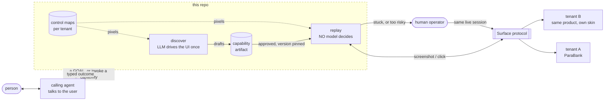
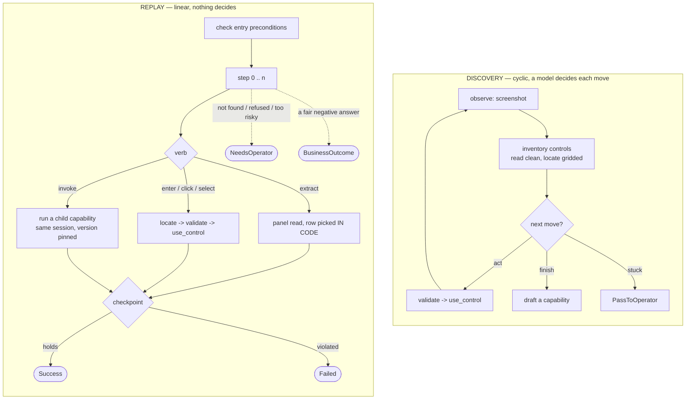
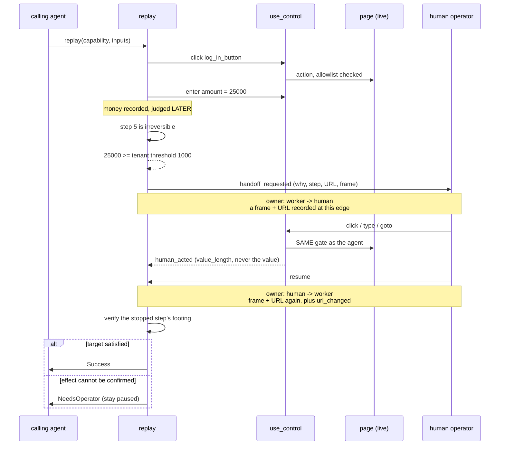
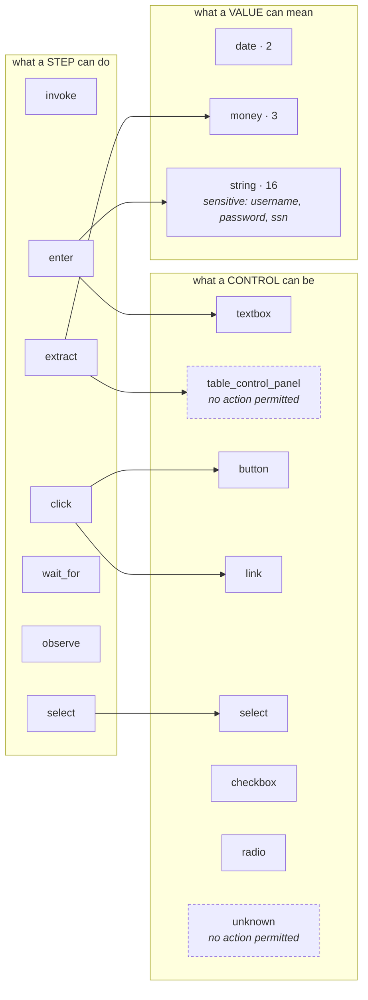
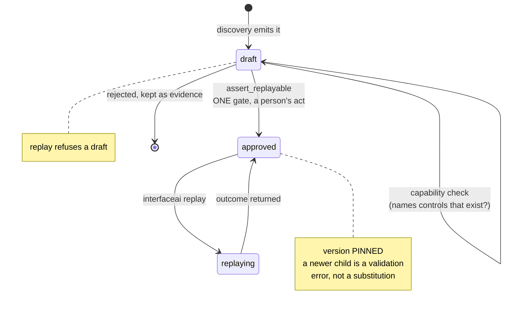

# Computer-Use Automation


- Topic: AI Automation on using a computer.
- Motivation: Replace a human's toil at doing back office banking work by building an AI agent that controls old computer banking apps to perform low risk operations. 
- High-level to automate a human using a computer:
  - Discovery: Iteratively build workflow of screen control click-type steps 
  - Replay: Execute workflow, ie. f(task_name, args, tenant-app configs) 

> [!NOTE]
> [InterfaceAI reqs](Assignment-A-Computer-Use-Automation.md) of this README 
> - "how to run without live services"
> - "a demo path: the exact command(s)..... 
> - DEMO PART 1 of 2: to run the agent on a goal, 
> - DEMO PART 2 of 2: then replay the resulting artifact.
> **What the brief asks a README to cover, and where each lands.** Paraphrased;
> the verbatim text is in
>
> | Assignment | here |
> |---|---|
> | §6.1 — set it up and run it | [1 · Install](#1--install) |
> | §6.1 — any keys or config it needs | [2 · Keys and config](#2--keys-and-config) |
> | §6 — target application | [3 · Run target application ("without a live service")](#3--start-the-target-application) |
> | §6.1 — a demo path, part 1: drive the agent at a goal | [Part 1 of 2](#part-1-of-2--run-the-agent-on-a-goal) |
> | §6.1 — a demo path, part 2: replay what that produced | [Part 2 of 2](#part-2-of-2--replay-the-resulting-artifact) |
> | §3.6 — bring a human into a stuck run | [5 · Escalation & handoff](#5--human-in-the-loop-escalation--handoff) |
> | §6.1 — running it without live services | [6 · Without live services](#6--running-without-live-services) |

## Quick start

### 1 · Install

**Assumptions**

- **Docker with `docker compose`** — the bank runs as a local container so that
  every run starts from an identical seed, which is what makes replay
  determinism measurable.
- a POSIX shell (on Windows, use WSL2)
- ports 8080-8081, 9001-9002, 61616-61617 free
- outbound network to your model provider
- amd64 or arm64 — both ParaBank images work

⚠️ **Verified end to end on amd64 Linux only**, cold clone, 2026-10-01. The
locators are template PNGs captured on Linux Chromium, so a different font
stack can miss — that is a UI-drift finding, not a broken setup.

`banking-jobs` and `interfaceai` are **the same binary under two names** — the
commands below use the first; older docs use the second.

```bash
git clone https://github.com/borisdev/ai_computer_use && cd ai_computer_use
curl -LsSf https://astral.sh/uv/install.sh | sh    # if you do not have uv
uv sync                                            # fetches Python 3.13 too
uv run playwright install chromium                 # the browser replay drives
```

### 1b · Run the agent in a container — do this on macOS or Windows

**A template PNG is specific to the stack that rasterised it.** The committed
`control_maps/` were built on Linux Chromium; matched against macOS Chromium
the first control of the first screen scores **0.6889** against a 0.95
threshold, and the run correctly escalates to a human instead of clicking
something it is 69% sure of. That is [issue
0012](docs/issues/0012-control-maps-are-rendering-stack-specific.md).

Running the agent in a container pins the stack, so the host leaves the path:

```bash
docker compose up -d --wait parabank
uv run banking-jobs env reset                       # host-side, no browser involved
docker compose run --rm agent replay log_in
```

Measured — the container reproduces the committed maps' stack exactly:

```
host        {'platform': 'linux', 'browser': 'chromium 153.0.8010.12', ...}
container   {'platform': 'linux', 'browser': 'chromium 153.0.8010.12', ...}
```

Artifacts, control maps and evidence are bind-mounted, so they land on your
disk, not in a layer. `run` gives a TTY, so the §5 handoff works in here too.

**Reaching each tenant** — the only difference is tenant B's address:

| | host | container |
|---|---|---|
| **tenant A** (`baseline`) | `localhost:8080` — the default, no flag | same address, no flag |
| **tenant B** (`feature`) | `--tenant-config tenant_configs/bank_b.yaml` | `--tenant-config tenant_configs/bank_b.docker.yaml` |

```bash
# tenant B, host
uv run banking-jobs replay read_savings_balance \
  --tenant-config tenant_configs/bank_b.yaml --param account_id=13344

# tenant B, container
docker compose --profile tenant-b up -d --wait
docker compose run --rm agent replay read_savings_balance \
  --tenant-config tenant_configs/bank_b.docker.yaml --param account_id=13344
```

Both print `cross-tenant replaying on feature` and then `SUCCESS … $1231.10`.
Tenant A needs no variant because `localhost:8080` means the same thing in
both places — that is what the shared namespace buys.

⚠️ The **origin allowlist differs inside**, and it refused before it was told:
the first container run against tenant B died on `NotAllowedError: navigation
to 'http://parabank-b:8080/…' is outside the allowlist`. That is the §3.4
guardrail working. compose sets the two origins that exist in there — not a
wildcard, and `localhost:8081` is deliberately absent since nothing serves it.

### 2 · Keys and config

**One secret: an OpenAI API key** — `sk-…` from
[platform.openai.com](https://platform.openai.com/api-keys), on an account with
billing. It pays for the vision calls that read the screen: control mapping
during discovery, and every `extract` step during replay.

```bash
cp .secret.example .secret     # then set OPENAI_API_KEY
```

⛔ **Not a ChatGPT Plus subscription** — that does not carry an API key. **Not
an Azure OpenAI key** either; those need an endpoint and a deployment name, and
are a separate path. Nothing else to configure: no endpoint, no resource, no
deployment, no region.

Using Azure anyway, or what still runs with no key at all: see
[Config](#config).

### 3 · Start the target application

```bash
docker compose up -d --wait       # ParaBank → localhost:8080
uv run banking-jobs env reset     # seed it — REQUIRED, see below
```

What you should see — **~9s and ~6s** once the image is local, plus a one-time
224 MB pull:

```
 Container parabank  Starting
 Container parabank  Waiting
 Container parabank  Healthy

Reseeded and verified http://localhost:8080/parabank
```

`env reset` POSTs to ParaBank's own admin page to create the schema, then
**polls until account 13344 is actually readable** and exits 1 if it never is.
`env status` and `env break` are the other two — `break` drops to a minimal
dataset so a replay hits a missing record.

⚠️ **`env reset` is not optional.** ParaBank boots with no database schema and
serves HTTP 200 throughout, so the healthcheck goes green on an app that cannot
answer a single question. Readiness is not liveness; `env reset` is the
readiness gate and blocks until the seed is verified.

### 4 · Demo path

§6.1 wants the exact commands for two things — pointing the agent at a goal,
then replaying what that produced. So they are two things here.

#### Part 1 of 2 — run the agent on a goal

**The only step with a model in the decision loop.**

```bash
uv run banking-jobs discover \
  --goal "read the balance of account 13344" \
  --name my_balance_reader \
  --param account_id=account_id=13344 \
  --secret parabank_username=username --secret parabank_demo_password=password
```

~13s:

```
discovered my_balance_reader in 3 steps, 4 model calls, 13s
  artifact  artifacts/my_balance_reader.v1.draft.json
```

#### Part 2 of 2 — replay the resulting artifact

Approval is the gate — replay refuses a draft.

```bash
uv run banking-jobs capability approve my_balance_reader --by "your name"
uv run banking-jobs replay my_balance_reader --param account_id=13344
```

```
approved artifacts/my_balance_reader.v1.approved.json by your name

SUCCESS my_balance_reader in 6 steps
  account_id = 13344
  balance = $1231.10
```

**The replay makes no decisions.** Step order, control, value and checkpoint all
come from the artifact; the only model call left is perception on an `extract`.
The discovery run proposed the accounts table as a `TABLE_CONTROL_PANEL` and
**measured** its pitch and extent with ink runs and autocorrelation — no pixel
is asked of a model — so the replay reaches row `13344` by parameter rather
than by coordinate.

```bash
uv run banking-jobs diagram my_balance_reader   # its flowchart, read from the artifact
uv run banking-jobs status                      # capabilities, runs and outcomes
```


### 5 · Human-in-the-loop escalation & handoff

The assignment's §3.6. Break the environment so the run is **genuinely** stuck —
a record it was recorded against no longer exists:

```bash
uv run banking-jobs env break
uv run banking-jobs replay log_in_discovered --operator
```

```
HUMAN NEEDED — log_in_discovered, step 4
  why        cannot read 12345_link: not_found (best score 0.8654 is below threshold 0.95)
  completed  enter username_textbox, enter password_textbox, click log_in_button, observe
  screenshot file:///.../frames/002-handoff-4-before.png
operator>
```

You now hold the live session: `click X Y`, `type TEXT`, `goto URL`, `shot`,
`url`, `resume`, `abort`. Your actions go through the **same allowlist and the
same redaction rule as the agent's**. `resume` re-verifies before continuing;
`handoff_requested` / `handoff_returned` bracket the window in the trace, each
with a frame and a URL.

⚠️ **The browser is headless, so that screenshot is your only view of the page**
and it does not update until you run `shot`. A co-browsing console is out of
scope (§3.6) — [#9](https://github.com/borisdev/ai_computer_use/issues/9)
records the design that would actually work.

Put the environment back when you are done:

```bash
uv run banking-jobs env reset
```

### 6 · Running without live services

The offline suite needs **no Docker and no key**:

```bash
uv run pytest -q -m "not live"      # 289 passed, 38 deselected
```

⛔ **Verified by stopping the containers, not by trusting the marker.** Pausing
ParaBank and running this on 2026-10-01 turned up three tests marked offline
that quietly needed the live app — they are `live` now. A suite that needs a
service it does not declare is one nobody else can reproduce.

The `live` 38 need ParaBank up; the discovery tests additionally need a key.

- **Start here** — [`HANDOFF.md`](HANDOFF.md): scope, what is proven, what is next
- **What is still open**, with a decision line per item — [`STILL-OPEN.md`](STILL-OPEN.md)
- Assignment brief — [`Assignment-A-Computer-Use-Automation.md`](Assignment-A-Computer-Use-Automation.md)
- Design write-up — [`REPORT.md`](REPORT.md)
- Target application notes — [`docs/parabank.md`](docs/parabank.md)
- Screen map (29 screens + graph) — [`docs/parabank-screens.md`](docs/parabank-screens.md)
- **Findings, mapped to the assignment** — [`docs/findings.md`](docs/findings.md)
- **Failure modes we have observed**, each with a test — [`docs/failure-modes.md`](docs/failure-modes.md)
- **What exists right now** (generated) — [`docs/status.md`](docs/status.md)
- **The two engine flows**, discovery and replay — [`docs/flows.md`](docs/flows.md)
- Capabilities and the vocabulary they imply — [`docs/capabilities-and-vocabulary.md`](docs/capabilities-and-vocabulary.md)
- Open issues — [`docs/issues/`](docs/issues/README.md)
- Decision records — [`docs/adr/`](docs/adr/README.md)

## Status

Everything the brief asks for runs: a real LLM discovery run, a typed
artifact, deterministic replay with typed outcomes, human handoff of the live
session, and one artifact serving two tenants.

```
331 tests — 293 offline, 38 live · ruff clean
```

| Piece | State |
|---|---|
| ParaBank target, both tenant variants | done |
| Seed fixtures, verified against the live app | done |
| Known-state / error-injection controls | done, round-trip verified |
| Perception — `extract_control_locators`, `locate_control`, `use_control` | done; grounding 3/3, replay drift (0,0) |
| **Capability artifact (§3.2)** — schema, validator, `draft → approved` gate | done; [ADR 0005](docs/adr/0005-capability-artifact-shape.md) |
| **Discovery (§3.1)** — goal-driven LLM loop against the live app | done; real run, evidence committed |
| **Deterministic replay (§3.3)** — typed outcome, no model deciding | done; success, business outcome and escalation all demonstrated |
| **Composition** — a capability invokes another, version pinned | done |
| **Escalation & handoff (§3.6)** — live session, ownership, verified resume | done; the handoff window is bracketed by before/after evidence |
| **Cross-tenant reuse (§3.7)** — one artifact, two tenants | done; adoption verifies and refuses on drift |
| **Recovery** — a lost session is re-established, once | done; `session_loss_probe` logs itself out and the run survives |
| **Value-dependent risk** — a payment over the tenant's threshold stops | done; and the tenant policy outranks `--confirm-risky` |
| **Tenant permissions** — which capabilities a tenant may run | done, and **make-believe**: ParaBank has no roles |
| **Generated docs** — `interfaceai status`, `interfaceai diagram` | done; [docs/status.md](docs/status.md), [docs/flows.md](docs/flows.md) |
| Controlled vocabulary, 34 terms | done in code; **not yet in the inventory prompt** |
| Persistence of runs / interventions | cut — see REPORT §7 |

Artifacts in `artifacts/` come from **both** routes, and which is which
matters: `log_in_discovered` and `discovered_balance` were produced by real
discovery runs against the live app — the second one **including its
`TABLE_CONTROL_PANEL`**, which was the last thing only a hand could add
([#6](https://github.com/borisdev/ai_computer_use/issues/6)); the earliest
`log_in` was hand-authored before discovery existed. The contrast is measured and unflattering to the hand
— the hand-written ones carry **3 and 8** faults against a real control map,
the discovered one carries **0**, because a hand-written artifact can name
anything and a discovered one can only name what it recorded. `interfaceai
capability check` is that check, and `interfaceai status` prints the counts.

Setting up a fresh machine: [`docs/vm-setup.md`](docs/vm-setup.md)

## Smoke test — every capability, both param forms

### Prerequisites

```bash
curl -LsSf https://astral.sh/uv/install.sh | sh    # if you do not have it
uv sync                                            # fetches Python 3.13 too
uv run playwright install chromium                 # the browser replay drives
```

Plus a Docker runtime with `docker compose`, and **a `VISION_API_KEY` in
`.secret`** — see [Config](#config):

```bash
cp .secret.example .secret     # then fill in VISION_API_KEY
```

⛔ **Measured from a cold clone 2026-09-30: almost nothing replays without a
key.** This paragraph used to say a key was needed "only for `discover` and for
`extract` steps", and that `log_in_discovered` replays with zero model calls.
Both claims were false, and a reviewer following them hits a stack trace on
their first command:

- `log_in_discovered` **has an `extract` step**, so it needs a key like any
  other. The sentence naming it as the keyless example named the wrong one.
- **A panel read calls the model and is not a verb.** `request_loan`'s verbs
  are `click`, `enter`, `invoke`, `wait_for` — no `extract` anywhere — and it
  still needs a key, because one step reads a `TABLE_CONTROL_PANEL`. Checking
  the verb list is exactly how this was missed twice.

**Two** of the eleven commands below run without a key, and both stop before
reaching a model: `log_in` (no `extract`, no panel) and the tenant refusal,
which fails pre-flight on permissions. Everything else calls the model.

⚠️ That sentence originally read *"one of the eleven"* and pointed at a
`capability check` flag that does not exist — written into this paragraph while
fixing the claim above it, and caught by running the command. The count is now
measured, not reasoned.

### Bring the banks up

**One compose file, two services.** Tenant B sits behind a profile, so it does
not start unless asked:

```bash
docker compose up -d --wait                  # tenant A  → localhost:8080
uv run interfaceai env reset                 # seed it — REQUIRED, see below

docker compose --profile tenant-b up -d --wait   # tenant B → localhost:8081
uv run interfaceai env reset --tenant-b
```

⚠️ **`env reset` is not optional.** ParaBank boots with **no database schema**
and serves HTTP 200 the whole time, so the healthcheck goes green on an app
that cannot answer a single question. Readiness is not liveness — `env reset`
is the readiness gate and it blocks until the seed is verified.

⚠️ `docker-compose.reskin.yml` is a **separate, optional** overlay that puts a
different brand on tenant B. It is for the drift experiment only and it
deliberately breaks two live tests while on — `scripts/reskin_tenant_b.sh off`
before running the suite.

### The table

| | |
|---|---|
| **read a balance** | `uv run banking-jobs replay read_savings_balance --params job_params/read_savings_balance.yaml` |
| | `uv run banking-jobs replay read_savings_balance --param account_id=13344` |
| **a fair negative answer** | `uv run banking-jobs replay read_savings_balance --params job_params/read_savings_balance.not_found.yaml` |
| **compose** | `uv run banking-jobs replay log_in` |
| **discovered by an LLM** | `uv run banking-jobs replay log_in_discovered` |
| **discovered, panel-backed** | `uv run banking-jobs replay discovered_balance --param account_id=13344` |
| **stop and ask a person** | `uv run banking-jobs replay request_loan --params job_params/request_loan.yaml --confirm-risky` |
| **survive a lost session** | `uv run banking-jobs replay session_loss_probe --params job_params/session_loss_probe.yaml` |
| **a second institution** | `uv run banking-jobs replay read_savings_balance --tenant-config tenant_configs/bank_b.yaml --param account_id=13344` |
| **refused by that tenant** | `uv run banking-jobs replay request_loan --tenant-config tenant_configs/bank_b.yaml --params job_params/request_loan.yaml` |
| **hand it to a human** | `uv run banking-jobs replay request_loan --params job_params/request_loan.yaml --operator` |

```bash
uv run banking-jobs status                    # every capability and recent run
uv run banking-jobs status --tenant feature   # what THAT tenant may run
uv run banking-jobs language                  # the controlled language, generated
uv run banking-jobs diagram read_savings_balance
```

⚠️ **`--param` beats `--params`** when both are given, so a committed file holds
the real inputs and a flag tweaks one for a single run. `banking-jobs` and
`interfaceai` are the same command.

## ▶ Start here — [CAPABILITIES.md](CAPABILITIES.md)

```bash
uv run interfaceai replay -c read_savings_balance --param account_id=13344
uv run interfaceai replay -c log_in_discovered --tenant feature
uv run interfaceai status  --tenant feature        # what this tenant may run
```

Five capabilities, each with the approved artifact, a committed trace per
tenant, a generated workflow diagram, and **the command to run it yourself**.
It is the shortest path into the design: composition, versioning, the outcome
types, the guardrails and the control language all show up there in concrete
form before any of them are argued.

## How it fits together

⚠️ **Which of these can lie to you.** The capability flowcharts and the language
map are **generated from the code** (`interfaceai diagram`, `interfaceai
language`) and cannot claim something the system will not do. The four below
are **hand-drawn** — they describe intent, and are the only pictures here a
reader must check against the source.

### 1. The world this sits in

A calling agent talks to a person, decides it needs something done in a bank
app that has no API, and hands us a **goal**. Everything inside the dashed box
is this repo.



**The artifact is tenant-agnostic; the control maps are not.** That split is
what lets one recording serve two institutions — and why a tenant miss refuses
rather than falling back to another tenant's pixels.

### 2. The two workflows, and they are different shapes

Discovery is a **loop** — look, decide, act, look again, until the goal is met
or it gives up. Replay is a **walk** — the steps are already known and nothing
chooses.



⚠️ **The loop is where the cost and the nondeterminism live**, which is the
whole argument for the artifact: pay for the loop once, then walk it forever.

### 3. The escalation, as a sequence



⚠️ **An irreversible step is never retried on a guess.** A submission that
silently succeeded and one that failed look identical from the outside.

### 4. The language, GENERATED from the types that enforce it

```bash
uv run interfaceai language
```



Three axes — what a **step** can do, what a **control** can be, what a **value**
can mean — and the interesting part is where they *do not* connect. Dashed
nodes have **no permitted action at all**: you cannot click a
`table_control_panel` (a region with rows, reachable only by `extract`) and you
cannot act on an `unknown`. That is the geometric guard and the grounding
refusal, expressed as a gap in the diagram rather than as a paragraph.

### 5. What an artifact is, and when it is trusted



*Each capability also draws itself, from its own artifact:*
`uv run interfaceai diagram read_savings_balance`. The two ENGINE flows above
are drawn by hand and live in [docs/flows.md](docs/flows.md).

## Requirements

- A Docker runtime with `docker compose` — Docker Desktop, OrbStack or Colima
- [`uv`](https://docs.astral.sh/uv/)
- Python 3.13 (uv fetches it)

## Getting started

```bash
uv sync                          # create .venv and install
cp .secret.example .secret       # then fill in ANTHROPIC_API_KEY

docker compose up -d --wait      # 1. start ParaBank, wait for Tomcat
uv run interfaceai env reset             # 2. seed the database, verify it took
```

Then open <http://localhost:8080/parabank> and log in as `john` / `demo`.

First run pulls `parasoft/parabank:baseline` (~250 MB; multi-arch, native on
both amd64 and arm64). After that a cold start is about 15 seconds.

⚠️ The arches do not ship the same packages — the amd64 image has neither
`curl` nor `wget`, which is why the compose healthcheck probes over `bash`'s
`/dev/tcp` instead of shelling out to an HTTP client.

### Why starting it is two commands

`docker compose up -d --wait` blocks on the container healthcheck, which proves
Tomcat has deployed the webapp. It does **not** prove the app works.

ParaBank boots with **no database schema** and serves HTTP 200 regardless. Its
lazy initialiser was observed logging `Database not yet initialized.
Initializing...` every 10 seconds for minutes without ever completing, while
`docker compose ps` reported `healthy` the whole time and every account lookup
failed.

So the second command is the readiness gate. `interfaceai env reset` posts
`action=INIT` to ParaBank's admin page and then blocks until account 13344 is
actually readable — it seeds *and verifies*, because a POST returning 200 is not
evidence the fixtures landed.

Full detail: [parabank.md §4](docs/parabank.md#4--it-boots-with-no-database-schema).
Why there is no `make up` wrapping this: [ADR 0003](docs/adr/0003-plain-docker-compose.md).

## Everyday commands

```bash
docker compose ps                # container state
docker compose logs -f parabank  # tail Tomcat
docker compose down              # stop; also wipes the DB (no volume)

uv run interfaceai env status            # ready / no data / down, per tenant
uv run interfaceai env reset             # reseed to the full fixtures
uv run interfaceai env break             # switch to the minimal dataset (see below)

uv run interfaceai capability list       # signatures and approval state
uv run interfaceai capability show read_savings_balance
uv run interfaceai capability validate   # check every artifact against the vocabulary
uv run interfaceai capability export     # (re)write artifacts/*.draft.json
uv run interfaceai capability approve read_savings_balance --by "your name"

uv run pytest -m "not live"      # offline tests
uv run pytest -m live            # live tests; needs the stack up
uv run ruff check . && uv run ruff format --check .
```

### Both tenants

```bash
docker compose --profile tenant-b up -d --wait
uv run interfaceai env reset
uv run interfaceai env reset --tenant-b
```

## The target

[ParaBank](https://github.com/parasoft/parabank) is Parasoft's demo bank: Spring
MVC + JSP on Tomcat 10, backed by an in-container HSQLDB.

It was chosen because it is legacy-shaped in the way the brief describes —
server-rendered `.htm` form posts, table layout, **zero `data-testid`
attributes**, and `;jsessionid=` rewritten into every URL. It does expose a REST
API, which the automation deliberately never uses; the premise of the exercise
is a bank app with no API worth integrating against. Tests use that API only as
an oracle, to check the automation read the right number off the screen.

Reasoning: [ADR 0001](docs/adr/0001-parabank-as-target.md).
Everything else known about it: [docs/parabank.md](docs/parabank.md).

Two services run the same vendor product at different builds:

| Service | Image tag | URL | Stands in for |
|---|---|---|---|
| `parabank` | `baseline` | <http://localhost:8080/parabank> | Tenant A, where capabilities are recorded |
| `parabank-b` | `feature` | <http://localhost:8081/parabank> | Tenant B, a drifted install of the same product |

Upstream, `baseline` and `latest` are the same digest and `feature` is a
distinct image — so tenant B is a genuinely different build, not a relabelling.
It is off by default, behind the `tenant-b` compose profile.

### Seed data

`src/interfaceai/parabank.py` holds the fixtures, read out of the app's own `insert.sql`
and confirmed against the running container. The ones that matter:

- `john` / `demo` — customer 12212, John Smith
- account **13344**, SAVINGS, **$1,231.10** — the balance a recorded lookup
  capability should return
- account **99999** — in no state, so a lookup legitimately finds nothing
- minimum balance **$100.00** — transferring below it trips ParaBank's own
  validation

Full table: [parabank.md §6](docs/parabank.md#6-seed-data-actioninit).

### Exercising error handling

Failures come from ParaBank's own admin page, so they are real app behaviour
rather than an injected stub. `uv run interfaceai env break` posts `action=CLEAN`, which
is **not** a wipe — it swaps in the app's minimal dataset:

| Account | After `env reset` | After `env break` |
|---|---|---|
| 13344 | SAVINGS $1,231.10 | **CHECKING $5,022.93** |
| 54321 | CHECKING $1,351.12 | `Could not find account #54321` |

One lever, both failure classes the replay contract has to tell apart: 54321
genuinely stopped existing (a business outcome the caller needs to hear), while
13344 still resolves as a *different record* (a violated checkpoint — a replay
that only checks "did I find it" hands a bank the wrong number).

Detail: [parabank.md §5](docs/parabank.md#5-the-two-database-states).

## Demo path

```bash
docker compose up -d --wait && uv run interfaceai env reset
```

### The headline: the assignment's own worked example

> *"look up member 12345 and read their current savings balance"*

```bash
uv run interfaceai replay artifacts/read_savings_balance.v3.approved.json \
  --param account_id=13344
```
```
SUCCESS read_savings_balance in 12 steps
  found_account_id = 13344
  balance = $1231.10
  account_type = SAVINGS
```

Three of those twelve steps are `log_in`, invoked with its version pinned. No
model chose any of them. Try `--param account_id=13122` ($1100.00) or `12345`
(**-$2300.00**, negative on purpose).

*Why it is built this way — composition, panel extraction, and why the
checkpoint compares a value rather than a presence — is
[REPORT §2](REPORT.md#2-artifact-schema).*

### A business outcome is an answer, not a crash

```bash
uv run interfaceai replay artifacts/read_savings_balance.v3.approved.json \
  --param account_id=99999        # in no seed row
```
```
record_not_found no row where account_id is '99999'; the table holds 11
```

**Exit 0.** The caller asked a fair question and got a real answer. Conflating
this with a failure is the mistake the brief's glossary names by name.

### The error path, produced by the application itself

```bash
uv run interfaceai env break     # posts action=CLEAN to ParaBank's own admin page
uv run interfaceai replay artifacts/log_in_discovered.v1.approved.json
```
```
NEEDS A HUMAN at step 4: cannot read 12345_link: not_found
                        (best score 0.8654 is below threshold 0.95)
  completed: enter username_textbox, enter password_textbox,
             click log_in_button, observe
```

**Exit 1.** It refuses to click something scoring 0.86, and carries what it
finished so a human can resume rather than restart. Add `--operator` to take
the live session at that point. Then `uv run interfaceai env reset`.

### Where the artifacts come from — a real LLM run

⭐ **Try the one that closed [#6](https://github.com/borisdev/ai_computer_use/issues/6).**
This is the brief's own worked example, discovered rather than written — a
model names the repeated structure, **geometry** measures it, and the row is
reached by a parameter:

```bash
uv run banking-jobs discover \
  --goal "read the balance of account 13344" \
  --name my_balance_reader \
  --param account_id=account_id=13344 \
  --secret parabank_username=username --secret parabank_demo_password=password

uv run banking-jobs capability approve my_balance_reader --by "your name"
uv run banking-jobs replay my_balance_reader --param account_id=13344
uv run banking-jobs diagram my_balance_reader
```

```
discovered my_balance_reader in 3 steps, 4 model calls, 22s
```

It emits six steps — login, an observe, and **two extracts from one
`accounts_overview_table_control_panel`, each carrying a `row_key`** — plus a
checkpoint it inferred on `account_id`. ⚠️ **No pixel is asked of a model:**
the read pass names the region, then ink runs and autocorrelation measure the
pitch, phase and extent.

⚠️ It will **not** match `read_savings_balance`, and that is the honest
remaining gap: that capability drills into the account-detail screen, where the
read pass still names a neighbouring region, so its second panel is hand-
measured (REPORT §7).

The older, non-panel example, if you want the simplest possible run:

```bash
uv run interfaceai discover \
  --goal "Log in to the bank as the seeded customer and reach the accounts overview." \
  --name log_in_discovered \
  --secret parabank_username=username --secret parabank_demo_password=password

uv run interfaceai capability check      # does every control it names exist?
uv run interfaceai status                # capabilities, runs and outcomes at a glance
uv run interfaceai diagram read_savings_balance    # its flowchart, read from the artifact
uv run interfaceai capability approve log_in_discovered --by "your name"
```

Replay refuses anything unapproved. Evidence for both phases lands in
`evidence/runs/`, and **six curated runs are committed** — discovery, success,
business outcome, escalation, recovery, and a safety refusal — indexed with
what each one shows in [`evidence/README.md`](evidence/README.md).

### A payment large enough to need a person

```bash
uv run interfaceai replay artifacts/request_loan.v2.approved.json \
  --param amount=25000 --param down_payment=5000 --confirm-risky
```
```
NEEDS A HUMAN at step 5: this step is irreversible and amount=25000,
  down_payment=5000 is at or above the 1000 threshold for this tenant;
  a person has to confirm it
```

Over the tenant's $1,000 threshold, so it stops at the submit button with the
form already filled. An ordinary $500 gets **past** the money rule — drop
`--confirm-risky` and both stop, for different and distinguishable reasons.

⚠️ **The $500 case does not currently end in `SUCCESS`, and that is a finding.**
v2 added `wait_for loan_result_panel` after the irreversible click, and the
happy path stopped succeeding immediately: ParaBank returns *"An internal error
has occurred"* for the submission replay makes, while the same inputs driven by
hand return *"Loan Request Processed"*. **v1 reported `SUCCESS` for that error
page for as long as it existed**, because nothing after the click looked. Root
cause open — [#12](https://github.com/borisdev/ai_computer_use/issues/12), with
everything already ruled out.

*Why a run-level flag cannot answer a tenant-level policy is
[REPORT §6](REPORT.md#6-safety).*

### A session that dies mid-flow

```bash
uv run interfaceai replay artifacts/session_loss_probe.v1.approved.json \
  --param account_id=13344
```
```
SUCCESS session_loss_probe in 8 steps
  found_account_id = 13344
  recovered accounts_overview_link gone -- log_in no longer holds
```

The capability logs itself out halfway through and the run survives it, saying
so. *Why a recovery is a `SUCCESS` rather than a fifth outcome type is
[REPORT §3](REPORT.md#3-determinism--error-handling).*

### One artifact, two institutions

```bash
docker compose --profile tenant-b up -d --wait && uv run interfaceai env reset --tenant-b
uv run interfaceai maps adopt index    --from baseline --to feature
uv run interfaceai maps adopt overview --from baseline --to feature --login
uv run interfaceai replay artifacts/log_in_discovered.v1.approved.json --tenant feature
```

`maps adopt` re-runs every locator against the target tenant's live screen and
**writes nothing if any drifted** — that check is the drift detector, not a
copy.

Every failure mode we have observed, with the fixture or lever that reproduces
it: [`docs/failure-modes.md`](docs/failure-modes.md). What is still open:
[`STILL-OPEN.md`](STILL-OPEN.md).

### Doing the handoff yourself

§3.6 is the piece you should *feel* rather than read about. Two runs, both
against the live app.

**1. A policy stop.** Nothing is broken; the system declines to proceed.

```bash
uv run interfaceai env reset
uv run interfaceai replay artifacts/request_loan.v2.approved.json \
  --param amount=25000 --param down_payment=5000 --confirm-risky --operator
```

You get a prompt. The run has filled the loan form and stopped **at the submit
button**, because $25,000 is over this tenant's $1,000 threshold.

```
operator> url                      where am I?
operator> shot                     writes a PNG to the run's evidence dir
operator> resume                   hand control back
```

⚠️ **Expect `resume` to keep it paused, and that is the point.** The blocked
step is irreversible, and the rule is that such a step is *never* retried on
the strength of "it looks like it did not happen" — a submission that silently
succeeded and one that failed look identical. Use `abort <reason>` to end it
deliberately; the reason lands in the run log.

**2. A broken world.** Now something really is wrong.

```bash
uv run interfaceai env break        # ParaBank's own admin page drops account 12345
uv run interfaceai replay artifacts/log_in_discovered.v1.approved.json --operator
uv run interfaceai env reset        # afterwards
```

It stops at step 4: `cannot read 12345_link: not_found (best score 0.8654)`.
Try navigating and looking around before deciding:

```
operator> goto http://localhost:8080/parabank/overview.htm
operator> shot
operator> abort 12345 genuinely does not exist; not a locator fault
```

**The full command set** — `help` prints it:

```
click X Y      type TEXT      goto URL      shot      url      resume      abort
```

Everything you type goes through `use_control`, the same gate the agent uses:
same allowlist, same redaction. The log records `value_length`, never the
value. Try `click 5 5` to watch it refuse you.

**Afterwards, read what it recorded about you:**

```bash
jq -r 'select(.event|startswith("handoff") or .=="human_acted")' \
  evidence/runs/<the-dir-it-printed>/trace.jsonl
```

You will see `handoff_requested` → `human_acted` → `handoff_returned`, each edge
carrying a frame and a URL, plus `url_changed`. That bracket is deliberate: the
per-action log is complete for what you did *through the terminal* and blind to
a hand on the mouse, so the honest claim is *what the page looked like when we
handed it over and when we got it back*.

⚠️ **`--headed` will not work on a machine with no display**, which is why the
operator surface is a terminal and `shot` is how you see the page. That is a
real constraint, not a shortcut — it is also why `page.pause()` was rejected
(REPORT §5).

### The reskin experiment (optional, and it breaks two tests on purpose)

REPORT §4's weakest claim was that cross-tenant reuse was only ever shown on
two identical skins. To test it properly, put a different brand on tenant B:

```bash
scripts/reskin_tenant_b.sh on
uv run interfaceai maps adopt index --from baseline --to feature
scripts/reskin_tenant_b.sh off        # ⛔ REQUIRED before the live suite
```

```
baseline -> feature   index: 8/25 locators matched
  nothing written — this tenant needs its own discovery run or overrides
```

⚠️ **Turn it off afterwards.** With the skin on, `test_cross_tenant_live.py`
fails — correctly, because the tenant really has drifted. Leaving it on reads
as two broken tests instead of as a result.

*What the 8 survivors say about template matching is
[REPORT §4](REPORT.md#4-heterogeneity--multi-tenant).*

## Every capability, with its evidence

**[CAPABILITIES.md](CAPABILITIES.md)** — the five authored capabilities, what
each one demonstrates *beyond itself*, which tenants they run on, a link to the
approved artifact, a committed trace per run, and the workflow diagram
generated from the artifact.

## What's next — the open work, as issues

Every remaining item is a GitHub issue with the reasoning in it, rather than a
TODO list that drifts from the code.

⛔ **[#6](https://github.com/borisdev/ai_computer_use/issues/6) — *"discovery
cannot produce a `TABLE_CONTROL_PANEL`"* — was the biggest one, and it is
closed.** `discovered_balance` is the artifact: a panel proposed by a read pass
and MEASURED by geometry (pitch by ink runs, confirmed against autocorrelation,
no pixel asked of a model), approved, and replayed on both tenants. What remains
is narrower and stated in
[CAPABILITIES.md](CAPABILITIES.md) — on two screens the read pass names a
different region than the one a capability wants, so `account_details_panel` is
still measured by hand.

| | why it matters |
|---|---|
| [#4](https://github.com/borisdev/ai_computer_use/issues/4) Extraction cannot point at unstructured data | half solved — tables and label/value pairs are panels; a lone value is not |
| [#7](https://github.com/borisdev/ai_computer_use/issues/7) Screenshots are written unmasked | redaction covers logs and artifacts, not frames. §3.4 names regulated data |
| [#9](https://github.com/borisdev/ai_computer_use/issues/9) The headless mirror | closes the unlogged-input path by construction; argued, and argued against, in REPORT §5 |
| [#8](https://github.com/borisdev/ai_computer_use/issues/8) REPORT is over length | the one failing mechanical check. **Not** to be fixed by moving the threshold |
| [#1](https://github.com/borisdev/ai_computer_use/issues/1) · [#2](https://github.com/borisdev/ai_computer_use/issues/2) · [#3](https://github.com/borisdev/ai_computer_use/issues/3) | observability and console work, deliberately shelved |

Closed by measurement rather than by code, which is the better outcome:
**0001** (inventory variance 15/24/22 → 36/36/36) and **A5** (control-id naming
churn → 0 over 62 ids). Both premises had already been fixed by something else.

## Grading this submission against the client's own rubric

```bash
uv run python3 evals/grade.py                                  # 3 graders x 2 draws
uv run python3 evals/grade.py --critique-rubric gpt-5.2-codex  # audit the RUBRIC
```

[`evals/rubric.yaml`](evals/rubric.yaml) quotes §6 and §7 verbatim; results
land in [`evals/results/`](evals/results/). Mechanical checks (seven headings,
demo commands resolve, evidence present) run in code — asking a model whether a
heading exists is a worse grep. Judged criteria go to three graders, two draws
each, and every score must cite a quote from the submission and name the
strongest argument that it is too high.

⚠️ **An LLM grading work an LLM wrote.** The bias is not removed, only made
inspectable. It found four real defects the author missed — see
[what-went-wrong.md](docs/what-went-wrong.md) — and `--critique-rubric` exists
because a rubric written by the graded party is the weakest link in it.

## Layout

```
docker-compose.yml     ParaBank, both tenants
REPORT.md              design write-up (brief deliverable)
docs/parabank.md       everything learned about the target
docs/adr/              decision records
src/interfaceai/
  settings.py          config from .env + .secret
  parabank.py          surface facts, seed fixtures, known-state controls
  surface.py           the perception/action seam; `use_control`
  screenshot2controls.py   `extract_control_locators`, `locate_control`
  vocabulary.py        the 34-term controlled vocabulary
  capability.py        the capability artifact: schema, validator, approval gate
  capabilities.py      the authored capabilities and the registry
  cli.py               `interfaceai` CLI
tests/                 offline fixture tests + live smoke tests
evidence/              discovery and replay run evidence (brief deliverable)
artifacts/             saved capability artifacts (brief deliverable)
```

## Config

`.env` is committed and holds URLs and flags. `.secret` is gitignored and holds
credentials; `.secret.example` shows the shape. Nothing that would fail a bank's
security review belongs in `.env`.

### Model profiles

`VISION_PROFILE` in `.env` selects one; `OPENAI_API_KEY` in `.secret` is the
only credential the default needs.

| profile | endpoint | state |
|---|---|---|
| `openai-gpt-4.1` *(default)* | provider default | verified 2026-10-07 — discovery, replay, 38 live tests |
| `gpt-4.1`, `gpt-4o`, `gpt-5.2-chat`, `gpt-5.2-codex` | Azure | produced every artifact committed before 2026-10-07; set `VISION_API_BASE` + `VISION_API_KEY` for your own resource |
| `claude-opus` | provider default | **untested** — reaches Anthropic, rejected on credit before the vision call |

**With no key at all**, `log_in` and the tenant refusal still replay and the
289 offline tests still run. Anything that reads the screen refuses before the
browser launches, rather than failing inside a traceback:

```
FAILED at pre-flight
  expected  OPENAI_API_KEY (profile 'openai-gpt-4.1') in .secret -- see .secret.example
  observed  not set, and request_loan reads from the screen
```

⚠️ **`.env` is committed and beats the default in `settings.py`** — that is the
control point. Flipping the code default alone did nothing: a run reported as
proof the new provider worked had gone to Azure, because this file still said
otherwise.

⚠️ **Every trace records which model drove it**, in `run_started.model`, so no
run has to be taken on trust. It used to be the hardcoded string `unset`, which
is why that wrong-provider run could not be caught by reading its own evidence.

```
"model": "openai-gpt-4.1:openai/gpt-4.1"
```

⚠️ **How the key problem was found**, which is the transferable part: not by
reading the config, but by cloning into an empty directory and running the
README's own commands. Nine of eleven died on a key the reader had no way to
supply — a hundred runs in the working tree could not have surfaced it, because
the key was always already there.
