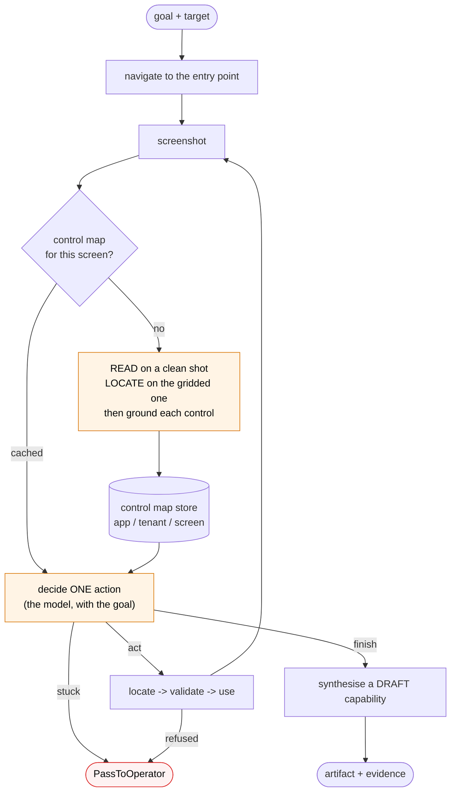
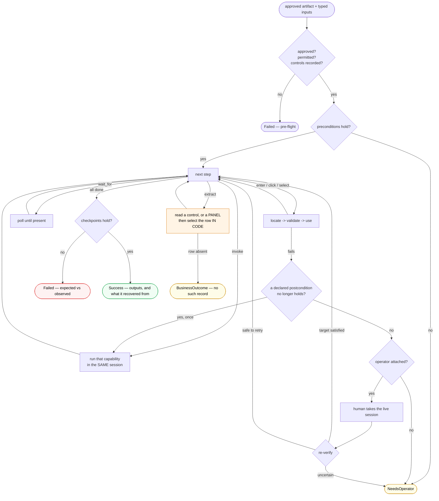

# The two engine flows

⚠️ **These draw the ENGINE, not a capability.** A capability's own flowchart is
generated from its artifact — `interfaceai diagram <name>` — and cannot drift
from what replays. These two are hand-drawn because they describe the code, and
they are the only diagrams here that a reader must check against it.

Related: [`status.md`](status.md) for what exists right now ·
[`failure-modes.md`](failure-modes.md) for what can go wrong.

---

## 1 · Discovery — an LLM in the loop, once

**Orange is where a model is consulted.** Cyclical by nature — it keeps choosing
a next action until the goal is met, it is stuck, or a stopping condition fires
(`max_steps`, timeout).

**Cost is dominated by the map, not the loop.** Grounding a screen is ~20–25
calls; a decision is one. So a map is built once per screen and reused by later
steps, later runs, and replay. Measured: a cold run maps two screens in ~100
calls; a warm one completes in **4 calls and 15 seconds**.

---

## 2 · Replay — no model decides anything

**A linear walk, not a loop** — the step list comes from the artifact, and the
node vocabulary is closed: `invoke · enter · click · select · wait_for ·
observe · extract`.

**One orange box.** `extract` is the only place a model is consulted, and only
to turn pixels into a value — perception, not decision. Nothing chooses an
action, an order or a verdict. **A capability with no `extract` step replays
with zero model calls.**

### Four exits, and each is a different thing

| | means | the caller should |
|---|---|---|
| `Success` | it worked. `recovered` names anything it survived | use the outputs |
| `BusinessOutcome` | a legitimate negative answer — no such record | use the answer |
| `Failed` | a checkpoint was violated, or the artifact cannot run | debug: expected vs observed |
| `NeedsOperator` | stopped safely; a person is needed | look, with the context carried |

There is deliberately **no `Recoverable`**: a recovered condition is not a
terminal state. If recovery works the run ends `Success`; if not, it escalates.
