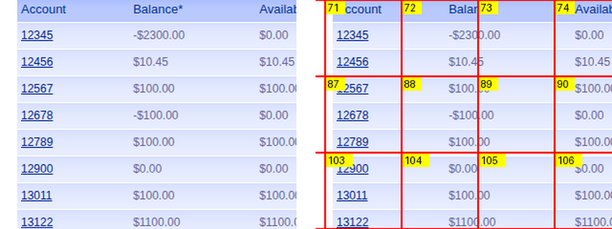

# 0008 — The model misreads dense numeric text. 6 of 11, measured.

**Severity: high.** It qualifies the project's headline finding, it puts wrong
account numbers into control ids today, and the fix proposed for
[0007](0007-parameterised-row-selection.md) depends on the thing that is broken.

## Measured

ParaBank's Accounts Overview, one real discovery run (2026-09-26), scored
against the REST oracle:

```
ground truth (11 accounts)  12345 12456 12567 12678 12789 12900 13011 13122 13233 13344 54321

read correctly   6   12345, 12456, 12678, 12789, 13122, 13344
WRONG            4   13001, 13323, 13767, 54221      <- no such account exists
missed           5   12567, 12900, 13011, 13233, 54321

                 6/11 = 54%
```

Three of the four wrong ones are **digit transpositions of a real account**:

```
  13011  ->  13001      a digit dropped and shifted
  13233  ->  13323      two digits swapped
  54321  ->  54221      one digit changed
```

The fourth, `13767`, matches nothing. None of the four announced any doubt.

## ⛔ ROOT CAUSE FOUND 2026-09-26: it is OUR GRID OVERLAY, not the model

The 6/11 above is real and reproduces. The explanation this issue originally
gave for it — small glyphs, uniform digits, no linguistic redundancy — is
**wrong**. Isolated by asking the same read-only question in four conditions,
three runs each:

```
condition            r1      r2      r3     invented
full, NO grid      11/11   11/11   11/11    none
full, WITH grid     8/11    8/11    9/11    13000, 54221, 5678, 56789
crop, NO grid      10/11   10/11   10/11    1267
crop, WITH grid    10/11   10/11   10/11    2567
```



*Left: what reads 11/11. Right: the same pixels with our overlay, which reads
8/11.*

**A clean full screenshot reads perfectly, three times out of three.** The same
image with our 192-cell overlay drawn on it drops to 8/11.

The confirmation is that it reproduces the live failure: the gridded condition
invented **54221**, which is one of the exact wrong ids from the real discovery
run, and it never appears without the grid.

⛔ **Sharpened 2026-09-26 by [0011](0011-control-panel-structured-read.md): it
is not "annotation", it is annotation ON TOP OF CONTENT.** Markers drawn in a
clear margin, one per row, cost nothing — 11/11 ids and 11/11 balances over
three runs, with the marker numbers also returned correctly. The 192-cell grid
hurts because its lines and badges cross the digits, not because it is an
overlay. So the fix is not "never annotate"; it is "never annotate over what you
need to read", which is a rule a drawing function can enforce — and now does.

**The instrument is corrupting the measurement.** Red cell borders and yellow
numbered badges are drawn across the content to solve the *locate* problem, and
they break the *read* problem on the same image.

⚠️ **Two earlier hypotheses, both disproved by this table, both mine:**

- *"small glyphs — magnify them"*. A magnification sweep at 1.0x / 1.5x / 2.0x /
  2.9x scored 11/11 at **every** level including no magnification at all. Size
  was never the variable.
- *"cropping is the variable"*. The first crop test scored 11/11, but it was
  cropped from a CLEAN screenshot. Held against grid, the crop is slightly
  *worse* than the clean full image (10/11 vs 11/11) — it clips context.

### What follows

The coarse pass asks one call to do two jobs on one image: **name every control**
and **assign each a cell number**. Those jobs want opposite images — reading
wants the content unobstructed, locating wants the annotation on top.

The cheap fix is to stop asking them together:

```
read pass     CLEAN screenshot   -> labels, roles, descriptions     measured 11/11
locate pass   GRIDDED screenshot -> which cell each named thing is in
```

One extra call per screen. It does not fix [0009](0009-wrong-row-grounding-is-silent.md)
on its own — cell assignment may be corrupted by the overlay too, and that is
**unmeasured** — but it removes the overlay from the half of the job that is now
known to be damaged by it.

## Why this matters more than it looks

**It contradicts the sentence this project has been building on.**
[findings.md §2](../findings.md) says, and has said since the first week:

> Vision models read a screen accurately and locate it badly.

That is still true **of labelled controls** — `Username`, `Password`, `Log In`
came back verbatim on every run, and that measurement stands. It is **not** true
of dense numeric data in a table. The original claim was measured on a login
screen with five well-spaced labelled controls, and generalised to "reading" as
a whole.

Three consequences, in order of how much they hurt:

1. **Control ids are slugs of read labels**, so `control_maps/.../overview.json`
   currently contains `13767_link` — an id for an account that does not exist.
   A capability naming it can never replay.
2. **[0007](0007-parameterised-row-selection.md)'s proposed fix is unsound as
   written.** It says: enumerate candidate rows, have the model read each one,
   pick the row whose text matches the bound parameter. At 54% that picks the
   wrong customer's account roughly half the time — and picks it *confidently*.
3. **Extraction is the same operation.** A capability whose declared output is a
   balance read off the screen is exposed to exactly this. Handing a bank the
   wrong number while reporting success is the failure this whole system exists
   to prevent.

## What it does NOT mean

Not "the model is unreliable, add retries". Nor, as this section said until the
root cause was found, "small glyphs with no linguistic redundancy" — the same
model reads the same glyphs at 11/11 when we stop drawing on them.

It also is not an argument against the dot-grid grounding work, which measured
3/3 and is unaffected — that asks the model to *point*, not to *read*.

## What to do instead

Untried, in rough order of preference:

- **Do not read the number at all.** ParaBank routes account details as
  `activity.htm?id=13344`, and §8 of the brief blesses `/item/12345 ->
  /item/:id` parameterisation explicitly. Navigating by a templated URL is
  deterministic and needs no reading. The cost is that it bypasses the screen,
  which cuts against [ADR 0002](../adr/0002-playwright-screenshot-control.md) —
  so it should be a recorded, deliberate fallback with its own provenance on the
  step, not a silent shortcut.
- ⛔ ~~**Zoom before reading.**~~ **Measured and rejected** — 11/11 at every
  magnification from 1.0x to 2.9x, so there was nothing for zoom to fix. Kept
  because it was the obvious idea and it was wrong.
- **Read it twice and require agreement.** Turns a silent wrong answer into a
  detectable disagreement. Doubles the cost and does not fix a stable misread.

## The check

`/tmp` scratch is not a check. The comparison above should live in the repo as a
`live`-marked test that reads the overview map, pulls ground truth from the REST
oracle, and asserts the read rate — so that a change intended to improve it can
be shown to have improved it, and so this number cannot quietly rot.

## Related

- [0007](0007-parameterised-row-selection.md) — depends on this being fixed
- [0001](0001-incomplete-inventory.md) — naming churn; this is naming *error*,
  which is worse: churn is visible across runs, a wrong id looks fine
