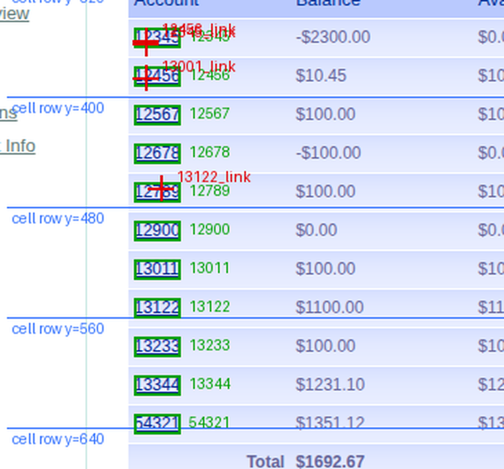
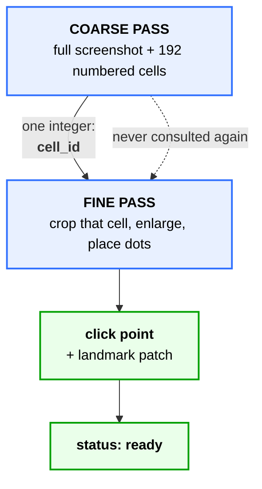
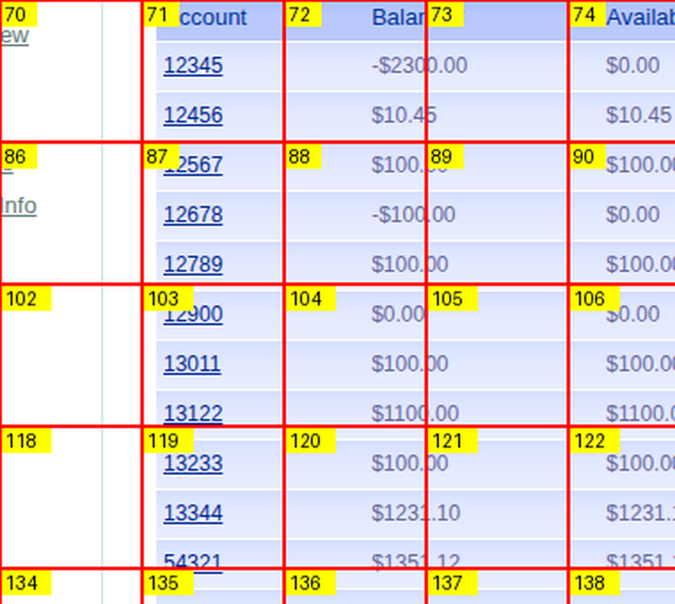

# 0009 — A grounded account link points at the **wrong row**, and reports `ready`

> **Severity: highest open.** Every other issue in this repo fails loudly. This
> one produces a confident click on a different customer's record and reports
> success — the exact failure the project exists to prevent.

| | |
|---|---|
| **Found** | 2026-09-26, first real discovery run against live ParaBank |
| **Screen** | Accounts Overview (`overview.htm`), 11 account links |
| **Score** | **1 of 4** grounded links land on their own row |
| **Fails** | silently — `status: ready`, unique landmark, ~1.0 match at replay |
| **Blocks** | trusting any control in a repeated structure; capability 1 end-to-end |
| **Related** | [0001](0001-incomplete-inventory.md) · [0007](0007-parameterised-row-selection.md) · [0008](0008-dense-numeric-text-is-misread.md) · [ADR 0002](../adr/0002-playwright-screenshot-control.md) |

---

## TL;DR

Discovery maps a screen in two passes: a **coarse** pass names each control and
says which numbered grid cell it sits in, then a **fine** pass crops that one
cell and picks the exact pixel to click.

On a table of eleven near-identical rows the coarse pass reports the wrong cell
number. The fine pass cannot tell — the wrong cell contains another account
link, which matches the description just as well as the right one would. It
grounds on it at full confidence.

**The result is a control named `13122_link` whose recorded click point is on
account 12789's row.** Nothing downstream can detect this.

---

## 1. The evidence

Green boxes are the real links, read from the DOM as an oracle. Red crosshairs
are where discovery ground a click point and marked the control `ready`. Blue
lines are the 80px coarse grid.



The crosshairs bunch in the top three rows while the accounts they *name* are
spread down the whole table.

| control | grounded at | its account's real row | verdict |
|---|---|---|---|
| `12345_link` | (500, **361**) | 350–364 | ✅ inside its own link |
| `12456_link` | (500, **359**) | 378–392 | ❌ that is **12345**'s row |
| `13122_link` | (511, **466**) | 546–560 | ❌ that is **12789**'s row |
| `13001_link` | (500, **386**) | — | ❌ **no such account exists** ([0008](0008-dense-numeric-text-is-misread.md)) |

The **column** is right every time (all links sit at x 492–525). The **row** is
wrong three times in four.

```
   80px coarse grid          real rows, 28px pitch        grounded point
 y=320 ├──────────────
                            12345  350..364   <--  12345_link (500,361)  ok
                            12456  378..392   <--  12456_link (500,359)  WRONG: 12345's row
 y=400 ├──────────────                        <--  13001_link (500,386)  WRONG: 12456's row
                            12567  406..420                              (+ no such account)
                            12678  434..448
                            12789  462..476   <--  13122_link (511,466)  WRONG: 12789's row
 y=480 ├──────────────
                            12900  490..504
                            13011  518..532
 y=560 ├──────────────
                            13122  546..560   <--  what 13122_link NAMES. nothing grounded here.
                            13233  574..588
                            13344  602..616   <--  capability 1 needs this. ungrounded.
 y=640 ├──────────────
                            54321  630..644
```

---

## 2. Why it is silent

`status: ready` means two things both succeeded: a click point was ground, **and**
the landmark patch around it self-matched uniquely on the discovery screenshot.

Both are true here. The landmark is a genuine, unique patch of screen. It is
simply wrapped around **the wrong row**.

So at replay `locate_control` finds that landmark, scores it near `1.0000`, and
clicks. The artifact says `13122_link`, it reviews cleanly, the click lands on
12789, and the run reports success with another customer's balance.

> Contrast the six links that *failed* to ground, `13344_link` among them. Their
> cell contained no account numbers at all, the model said so, and they came
> back `unresolved`. **Those are the benign half.** An honest `unresolved` costs
> a re-run; a wrong `ready` costs a wrong record.

---

## 3. How the two passes fit together



The fine pass receives **one integer** and a description. It never sees the whole
screen again, so **it cannot check the cell number it was handed.**

---

## 4. What the coarse pass is actually asked to do

This is the overlay it receives, cropped to the table:



Cell **71** holds two account links. Cells **87**, **103** and **119** hold three
each — and every one of those cells is visually interchangeable: underlined blue
numbers, same column, same spacing.

The prompt asks, verbatim:

> `cell_id`: the number of the grid cell containing the control's **centre**

So for eleven identical rows the model must count grid rows down a uniform
column and emit the right number out of 192. That is the task that fails.

### The trace for `13122`

```
truth     13122 is in cell 103
coarse    says cell 87                       <- miscounted the grid rows
fine      crops cell 87, looks for "an account number link"
          finds 12567 / 12678 / 12789 -- three of them, all plausible
          grounds on 12789, returns click(n) at full confidence
result    status: ready, landmark unique, ~1.0 at every future replay
```

---

## 5. Root cause

> ⛔ **Corrected.** This section first said *"an 80px cell holds three 28px rows,
> so the rows are ambiguous within a cell."* That explains **one** of the three
> failures. Checking properly inverted both the diagnosis and the remedy.

The fine pass can only ground *inside* the cell it was handed, so
`cell(grounded_y)` **is** the assigned cell. That makes the question testable:
does the true row sit in that same cell?

| control | assigned cell | true cell | verdict |
|---|---|---|---|
| `12345_link` | 320–400 | 320–400 | correct anyway |
| `12456_link` | 320–400 | 320–400 | within-cell ambiguity |
| `13122_link` | 400–480 | 480–560 | **wrong cell by 1** (80px) |
| `13001_link` | 320–400 | 480–560 | **wrong cell by 2** (160px) |

**The dominant failure is cell *assignment*, not cell *resolution*.** Only
`12456_link` is the three-rows-per-cell story.

That is the same defect [0001](0001-incomplete-inventory.md) already names as an
aggravating factor, surfacing somewhere new:

> **192 numbered cells**, nearly all of them empty. The model must enumerate
> controls *and* map each to one of 192 numbers.

Enumerating is one task. Mapping each result onto a number in a 192-cell overlay
is a second, and it is the one that breaks here.

### The assumption that failed

The algorithm quietly assumes **a wrong cell will look wrong**. That holds when
controls are distinguishable — it is why the login screen scored 3/3 — and both
outcomes are visible in the same run:

| | what the cell contained | outcome | assumption |
|---|---|---|---|
| **6 links** | the balance column — nothing resembling an account link | `unresolved` | ✅ held |
| **3 links** | a *neighbouring account cell* — a plausible target | grounded on it | ❌ failed, silently |

Telling 12789 from 13122 requires reading five small digits, which
[0008](0008-dense-numeric-text-is-misread.md) measures at **54%**. So even the
check that *could* catch this is unreliable at exactly this text size.

**This is not a model-quality problem.** Both passes did what they were asked.
The defect is the handoff: one integer, no route back to the full screen, and no
step that asks whether the thing grounded is the thing named.

---

## 6. What would catch it

| approach | cost | status |
|---|---|---|
| **Tile the scan** — show each of 6 zones on its own, enlarged up to 4x, so the model picks among far fewer cell numbers on far bigger glyphs. Shrinks the failing task rather than enlarging it. | 6 calls instead of 1, **plus writing it** | **not implemented** — `tile_*` sits in `DiscoveryConfig` and nothing reads it. 0001 measured a scratch prototype for inventory *stability* (27/27/26 vs 24/19/24); its effect on cell *assignment* is unmeasured |
| **Verify after grounding** — zoom the grounded point, ask what is there, refuse if it does not match the control's own label. Closes the currently-open loop. | +1 call per control | leans on reading, 54% per [0008](0008-dense-numeric-text-is-misread.md) |
| **Do not put a row on the path at all** — [0010](0010-extraction-cannot-point-at-data.md). The balance is already on the overview table; clicking the row was never needed to read it. | none | **removes this issue from capability 1's path entirely** |
| **Anchor the table, index the row** — [0007](0007-parameterised-row-selection.md#a-candidate-that-needs-no-per-row-grounding-at-all-2026-09-26). Template-match the header (unique, unlike every row), get the 28px pitch by autocorrelation, get the order from a clean read, then do arithmetic. | 1 match + 1 read | **no cell assignment anywhere**; pitch measured at 0.899, order at 11/11 |
| **Do not target rows visually** — ParaBank routes details as `activity.htm?id=13344`. Deterministic, no reading, no grounding. | breaks the desktop seam ([ADR 0002](../adr/0002-playwright-screenshot-control.md)) | viable as a **recorded** fallback with provenance on the step, never a silent shortcut |

> ⛔ **A finer grid is the wrong fix**, and was proposed here before the
> measurement in §5. It helps the one within-cell case and makes the two
> dominant ones worse: halving the cell size quadruples the cell count, and
> picking correctly out of 192 is already what fails. Recorded rather than
> deleted, because it is the intuitive answer and the next person will reach for
> it too.

---

## 7. The check that should exist

The measurement in §1, as a `live`-marked test: log in, read the real link boxes
from the DOM oracle, and assert that every `ready` control whose id looks like an
account number grounds inside that account's own link.

It goes **red today at 1/4**, which is the right starting state for a check.

```bash
docker compose up -d --wait && uv run interfaceai env reset
uv run pytest -m live -k account_links     # not written yet
```

---

## 8. Corrections to this issue

Kept visible, because each was a confident claim that a ninety-second check
disproved.

| | claim | what the check showed |
|---|---|---|
| 1 | "capability 1 would escalate — same root as [0008](0008-dense-numeric-text-is-misread.md)" | True but it is the *benign* half; the dangerous half is the 3 silent wrong-row groundings, which I had not looked at |
| 2 | "root cause is 80px cells against 28px rows" | Explains 1 failure of 3. Two were assigned a cell the link is not in at all |
| 3 | "a finer grid fixes it" | Inverted — it worsens the two dominant cases |

---

## 9. Related

- [0008](0008-dense-numeric-text-is-misread.md) — same screen, same cause, but **loud**: the label is wrong (`13011` → `13001`) so the id is visibly bogus. Here both ids are real and only the position is wrong.
- [0007](0007-parameterised-row-selection.md) — wanted to pick a row by reading it; this says the row it lands on is not reliably the row it named.
- [0001](0001-incomplete-inventory.md) — names the 192-cell mapping task as an aggravating factor; this is that factor causing a correctness bug rather than instability.
- [0010](0010-extraction-cannot-point-at-data.md) — why a row was on the path at all. It did not have to be, and for reading a value it should not be. This issue stays open for capabilities that must genuinely *act* on one of N identical rows.
