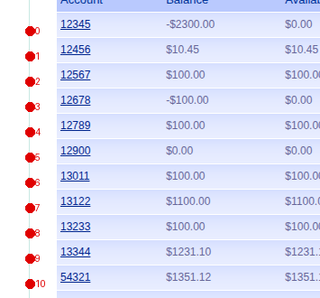

# 0011 — Control panels: locate a region, read it with a schema

> **Status: measured, partly built.** Steps 2 and 3 of four are code with tests.
> Steps 1 and 4 are not written.

A proposal from Boris, 2026-09-26, after [0009](0009-wrong-row-grounding-is-silent.md)
showed per-row grounding landing on the wrong record 3 times in 4:

> Perhaps simpler is just have a **ControlPanel locator**. If it's a control
> panel it's easy to identify its bbox, then we send the screenshot of the
> control panel to the LLM to extract the data — we give it a response schema,
> here a list of account objects. We can even pre-coordinate-label the image
> beforehand so it can provide click points as a structured field.

Every part of that is now measured. It works, and it makes three open issues
stop blocking the assignment's own worked example.

---

## The idea

Stop treating a table as N controls. Treat it as **one region with structure**.

```
CONTROL          a thing you act on          located individually, then clicked
CONTROL PANEL    a region with structure     located ONCE, then read with a schema
```

A panel is unique on its screen — the accounts table, the login form, the nav —
so template matching works on it. Individual rows are self-similar, which is
exactly what defeats template matching ([findings.md §3](../findings.md): a
control's own bbox matched *Username and Password*, 3 positions).

---

## The chain

| # | step | mechanism | state |
|---|---|---|---|
| 1 | locate the panel | template-match a non-repeating anchor (the header row) | **not built** — needs discovery to name panels |
| 2 | find the row rhythm | autocorrelation of a column's brightness | ✅ [`table.find_row_rhythm`](../../src/interfaceai/table.py) |
| 3 | mark each row | one numbered marker per row, **in the margin** | ✅ [`table.annotate_rows`](../../src/interfaceai/table.py) |
| 4 | read it | one model call, response schema returns fields **and** marker per row | **not built** — measured by probe only |



*What step 3 produces and step 4 would send. Markers 0–10 in the margin, one per
row, content untouched. Marker 9 is account 13344.*

---

## Measured

**Step 2 — rhythm.** `28px at 0.899`; next candidate `0.385`; the `56px`
harmonic at `0.805` corroborates. Non-table regions score 0.364 (empty margin),
0.324 (prose), 0.216 (a login form), so the 0.6 threshold sits in open space.
Pure numpy — no model, no network.

**Step 4 — the structured read**, three runs each:

```
clean crop, schema = list[{account_id, balance}]       ids 11/11   balances 11/11
marked crop, schema also returns the marker number     ids 11/11   balances 11/11
                                                       markers [0..10] all correct
```

**So annotation is free, and that rewrites [0008](0008-dense-numeric-text-is-misread.md)'s
conclusion.** The 192-cell grid does not hurt because it is an overlay; it hurts
because it draws **across the content**. Markers in whitespace cost nothing.

### ⚠️ The measurement that got there, because it was nearly a false finding

The first marked-crop probe scored **0/11** — a result so total it looked like
proof that annotation destroys reading. It was the probe's fault: the dots were
placed at the column centre, so `12345` rendered as `12●45`. I had covered the
data and was about to report it as a property of models.

That is now a test — `test_markers_never_touch_the_content` — which compares
every pixel at or right of the content edge before and after annotation, and is
mutation-checked to fail when a marker is drawn over a digit. `annotate_rows`
also **raises** rather than drawing when the margin is too narrow, because this
failure is invisible in the output and looks like a model error.

---

## Why this beats the alternatives

| approach | reads needed | grounding needed | state |
|---|---|---|---|
| ground each row ([0009](0009-wrong-row-grounding-is-silent.md)) | 0 | 11, and 3 of 4 land wrong | measured failing |
| read each candidate row ([0007](0007-parameterised-row-selection.md) original) | 11, on a gridded image | 0 | depends on 0008 |
| **panel + schema** | **1** | **1, on a non-repeating anchor** | **11/11 × 3** |

It also answers [0010](0010-extraction-cannot-point-at-data.md) — extraction has
nowhere to point because `EXTRACT` targets a control and data is not a control.
A panel read returns *typed fields*, so the artifact can declare
`balance: Money` without naming a control at all.

---

## Open, and the naming question is a human's

- **Step 1 has no mechanism.** Something must decide "this region is a panel"
  and record its anchor. Discovery does not have the concept.
- **Step 4 is a probe, not code.** The schema is hand-written per panel in the
  probe; where the schema comes from is undecided — the controlled vocabulary
  ([0006](0006-controlled-vocabulary.md)) is the obvious source.
- **Order must come from the same render as the click.** If rows reorder between
  the read and the action, the marker index is stale.
- **Zebra striping reports the stripe period, not the row height.** Pinned by a
  test. The anchor disambiguates: if the header-to-row-1 offset disagrees with
  the pitch, the pitch is a harmonic.
- ⚠️ **What is this called, and what type is it?** `ControlPanel`? A new
  `ControlRole`? A separate inventory? `LocatedControl` already strains — a
  panel is not a control and neither is a balance. This is a vocabulary
  decision, and per the house rule it is proposed here rather than taken.

---

## Related

- [0007](0007-parameterised-row-selection.md) · [0008](0008-dense-numeric-text-is-misread.md) · [0009](0009-wrong-row-grounding-is-silent.md) · [0010](0010-extraction-cannot-point-at-data.md)
- Code: [`src/interfaceai/table.py`](../../src/interfaceai/table.py) · Tests: [`tests/test_table.py`](../../tests/test_table.py) (29)
