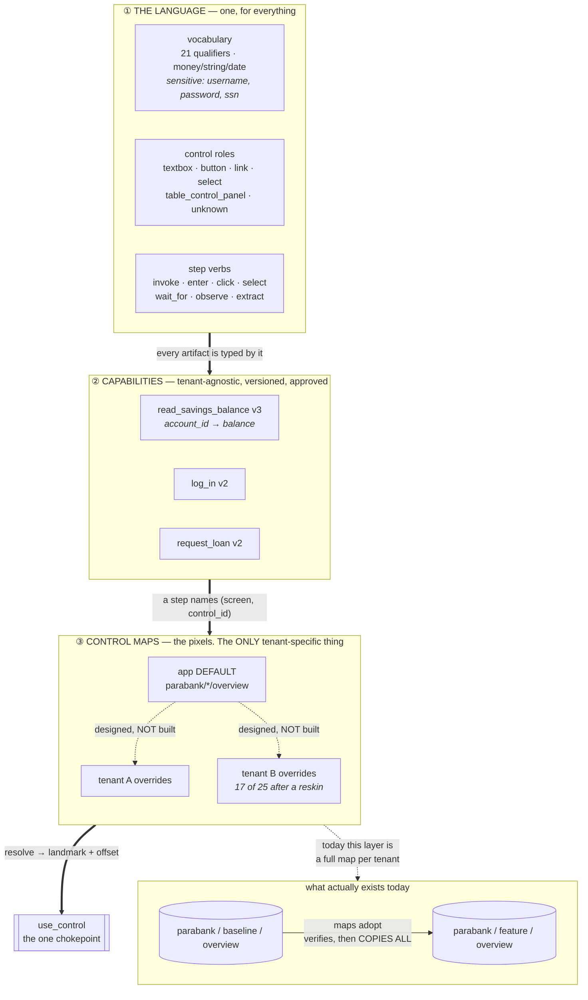

# One language, many tenants: what is shared and what is not

The question this answers: a capability recorded once at one bank — what
travels to the next bank, and what has to be re-measured?

⚠️ **Solid lines are built. Dashed lines are designed and not built**, and the
distinction matters more here than anywhere else in the repo: the layering
below is the shape this *should* take, and only two of its three layers exist.



## ① The language is shared by everything, and it is generated

`uv run interfaceai language` draws it from `VOCABULARY`, `ControlRole`,
`StepVerb` and `ACTIONS_BY_ROLE`, so it cannot claim a pairing the guardrails
would refuse. One vocabulary across apps and tenants is the deliberate default:
same vendor product, same concepts, and **fixed beats perfect** — a language
that grows to make one task easier is a synonym list.

## ② A capability is tenant-agnostic. That is the whole point.

A step names `(screen, control_id)` and never a pixel, a coordinate or a URL.
`Target` records what it was *authored against* — it is provenance, not a
destination. The same artifact replays on tenant B by resolving against B's
map.

## ③ ⛔ Default + overrides is the right shape and is NOT what is built

Today: **a complete control map per `(app, tenant, screen)`**, filled by a
discovery run on that tenant or by `maps adopt`, which re-runs every locator
against the target and **writes nothing if any drifted**.

That is honest and safe, and it does not scale:

```
built     N tenants × M screens × every control       a full copy each
designed  1 app default + only the controls that DRIFT per tenant
```

**The reskin measurement is the argument for the change.** Bank B's brand over
the same product: **8 of 25 locators survived**, and the survivors were exactly
the image-anchored ones while every text-anchored one drifted. So tenant B
needs **17 overrides, not 25 locators** — and the 8 that hold are the ones you
should never have copied, because copying them is what makes a later fix to the
default not reach the tenant.

⚠️ And the reason to build it is not storage, it is **propagation**: with a full
copy, fixing a locator in the default reaches nobody.

## The search question, and the honest answer

> *"How do we search per tenant and per app?"*

You **cannot search capabilities by tenant, and should not be able to** — that
is the tenant-agnostic property doing its job. The two real axes are different:

```
by APP       which product is this for?      Target.app
by TENANT    may this tenant run it?         allowed_capabilities(tenant)
```

So *"what can tenant B run?"* is not a search over capabilities. It is:

```
capabilities(app) ∩ permitted(tenant)
```

Both halves exist — `Target.app` on every artifact, and `Settings.
allowed_capabilities(tenant)`, which **refuses an unlisted tenant** rather than
running it unrestricted. What does **not** exist is the query over them:
`interfaceai status` lists every capability and filters by neither.

## ⛔ What is being queried, and where the index is

Boris asked, and the honest answer narrows the claim above.

**What is queried: the artifacts themselves.** `read_artifacts` globs
`artifacts/*.json`, opens **every** file, parses each into a full `Capability`,
and filters in memory. Measured on this repo:

```
16 files · 60,574 bytes · 2.4 ms      0.15 ms per artifact
```

### Two stores, two shapes, and the difference is not accidental

```
ARTIFACTS   one JSON DOCUMENT per capability version
            16 files, 60 KB  ->  10 typed Capability objects   2.5 ms

EVIDENCE    one JSONL file per run, one object per EVENT
            676 files, 9,666 lines, 1.6 MB  ->  676 run rows   48.5 ms
```

Boris guessed "a directory of jsonl loaded into dicts to filter on" — that is
exactly the **evidence** store, and deliberately not the artifact one.

> **One store holds things that must be TRUE. The other holds things that WERE
> true.**

An artifact is a contract that gates unattended replay, so it is parsed into a
**type**, not a dict: loading it as a dict would skip every invariant —
`_answers_are_checked`, `_irreversible_steps_are_observed`, the sensitive-slot
rules, the `draft → approved` gate. A capability that fails validation must not
be listable as if it were fine.

An event already happened. There is nothing to enforce, so it is append-only
JSONL, scanned and reduced. That is also why a run writes its own
`replay_finished` verdict rather than leaving a reader to infer one from where
the lines stopped.

**Where is the index: there isn't one, in either.** That is a full scan, and calling it a
query overstated it. At this size the scan IS the index and building another
would be worse — a derived index that can disagree with the artifacts is the
thing this repo has been fixing all week. Projected linearly it is ~0.9 s at
6,000 artifacts, which is where you would start wanting one.

### ⚠️ And the two halves of that join do not live in the same place

This is the part the earlier version of this page got wrong by implying one
lookup:

```
target.app                    IN the artifact       travels with the registry
allowed_capabilities(tenant)  IN the deployment     never leaves it
```

A tenant's permissions are not a property of a capability, and should not be —
a capability is tenant-agnostic. So:

> **The shared registry can answer *"which capabilities exist for app X"*.
> It can NEVER answer *"which may tenant B run"*.** Only a deployment can,
> because only a deployment holds its own allowlist.

That is why `interfaceai status --tenant feature` works *in a deployment* and
why there is no central per-tenant view to build. If you ever want one, the
allowlists have to be published somewhere both sides can read — which is a new
distributed-state problem, not a query.

⚠️ **A git directory is the registry today, and that is a deliberate cut.**
Artifacts are files, versioned, reviewed in PRs, with approval recorded in the
file. The fix when a scan stops being enough is an index **derived** from the
artifacts and rebuilt from them, never a second source of truth.
