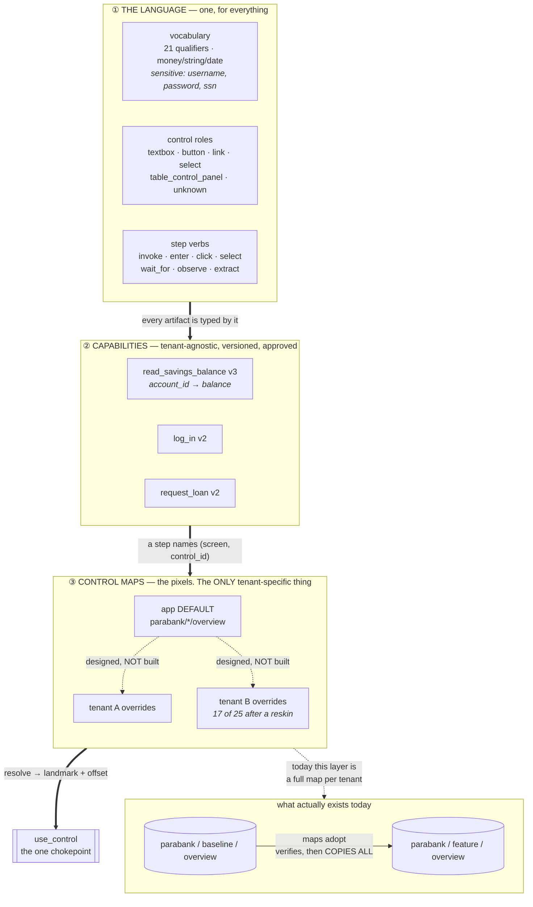

# One language, many tenants: what is shared and what is not

The question this answers: a capability recorded once at one bank — what
travels to the next bank, and what has to be re-measured?

⚠️ **Solid lines are built. Dashed lines are designed and not built**, and the
distinction matters more here than anywhere else in the repo: the layering
below is the shape this *should* take, and only two of its three layers exist.



## ① The language is shared by everything, and it is generated

`uv run interfaceai language` draws it from `VOCABULARY`, `ControlRole`,
`StepVerb` and `ACTIONS_BY_ROLE`, so it cannot claim a pairing the guardrails
would refuse. One vocabulary across apps and tenants is the deliberate default:
same vendor product, same concepts, and **fixed beats perfect** — a language
that grows to make one task easier is a synonym list.

## ② A capability is tenant-agnostic. That is the whole point.

A step names `(screen, control_id)` and never a pixel, a coordinate or a URL.
`Target` records what it was *authored against* — it is provenance, not a
destination. The same artifact replays on tenant B by resolving against B's
map.

## ③ ⛔ Default + overrides is the right shape and is NOT what is built

Today: **a complete control map per `(app, tenant, screen)`**, filled by a
discovery run on that tenant or by `maps adopt`, which re-runs every locator
against the target and **writes nothing if any drifted**.

That is honest and safe, and it does not scale:

```
built     N tenants × M screens × every control       a full copy each
designed  1 app default + only the controls that DRIFT per tenant
```

**The reskin measurement is the argument for the change.** Bank B's brand over
the same product: **8 of 25 locators survived**, and the survivors were exactly
the image-anchored ones while every text-anchored one drifted. So tenant B
needs **17 overrides, not 25 locators** — and the 8 that hold are the ones you
should never have copied, because copying them is what makes a later fix to the
default not reach the tenant.

⚠️ And the reason to build it is not storage, it is **propagation**: with a full
copy, fixing a locator in the default reaches nobody.

## The search question, and the honest answer

> *"How do we search per tenant and per app?"*

You **cannot search capabilities by tenant, and should not be able to** — that
is the tenant-agnostic property doing its job. The two real axes are different:

```
by APP       which product is this for?      Target.app
by TENANT    may this tenant run it?         allowed_capabilities(tenant)
```

So *"what can tenant B run?"* is not a search over capabilities. It is:

```
capabilities(app) ∩ permitted(tenant)
```

Both halves exist — `Target.app` on every artifact, and `Settings.
allowed_capabilities(tenant)`, which **refuses an unlisted tenant** rather than
running it unrestricted. What does **not** exist is the query over them:
`interfaceai status` lists every capability and filters by neither.

⚠️ **A git directory is the registry today, and that is a deliberate cut, not
an oversight.** Artifacts are files, versioned, reviewed in PRs, with approval
recorded in the file. For one app and two tenants a directory listing is the
index. It stops being enough at roughly the point where a human cannot hold the
list in their head — and the fix then is an index derived from the artifacts,
never a second source of truth that can disagree with them.
