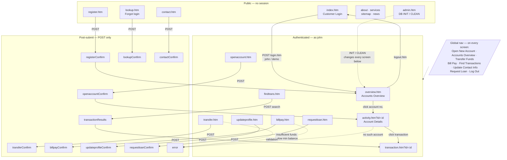

# ParaBank screen map

Enumerated by a GET-only crawl of the running app (logged out, then as `john`),
canonicalising `;jsessionid` out of every URL and collapsing record ids
(`activity.htm?id=13344` -> `activity.htm?id=:id`) so the count is of *screens*,
not instances.

Forms were never submitted — doing so would open accounts and move money, which
would break the fixtures replay depends on. Screens only reachable by POST are
listed from the app's own JSP templates and marked accordingly.

## Count

**29 distinct screens**, in three groups:

| Group | Count | Reached by |
|---|---|---|
| Public | 9 | GET, no session |
| Authenticated | 10 | GET, needs login |
| Post-submit results | 10 | POST only — not crawled |

## Public (9)

| Screen | Heading | Forms / inputs |
|---|---|---|
| `index.htm` | *(landing + Customer Login)* | 1 / 2 |
| `register.htm` | Signing up is easy! | 2 / 15 |
| `lookup.htm` | Customer Lookup | 2 / 11 |
| `contact.htm` | Customer Care | 1 / 5 |
| `about.htm` | ParaSoft Demo Website | 0 / 0 |
| `services.htm` | *(untitled)* | 0 / 0 |
| `sitemap.htm` | *(untitled)* | 0 / 0 |
| `news.htm` | ParaBank News | 0 / 0 |
| `admin.htm` | Administration | **3 / 14** |

`admin.htm` requires no authentication. It is the control surface for
[the two database states](parabank.md#5-the-two-database-states).

## Authenticated (10)

| Screen | Heading | Forms / inputs |
|---|---|---|
| `overview.htm` | Accounts Overview | 0 / 0 |
| `activity.htm?id=:id` | Account Details | 1 / 3 |
| `transaction.htm?id=:id` | *(transaction detail)* | 0 / 0 |
| `transfer.htm` | Transfer Funds | 1 / 4 |
| `billpay.htm` | Bill Payment Service | 1 / 11 |
| `openaccount.htm` | Open New Account | 1 / 3 |
| `requestloan.htm` | Apply for a Loan | 1 / 4 |
| `findtrans.htm` | Find Transactions | 1 / 6 |
| `updateprofile.htm` | Update Profile | 1 / 8 |
| `logout.htm` | *(redirects to `index.htm`)* | — |

`transaction.htm` needs a transaction id that exists; with a bare account id it
renders the error screen. The seeded accounts have no transactions until one is
made, so it is only reachable after a transfer or bill payment.

## Post-submit results (10, POST only)

From `webapp/WEB-INF/jsp/content/`. Each shares a route with the form that
produces it, so a URL alone will not reach it:

`registerConfirm` · `openaccountConfirm` · `transferConfirm` · `billpayConfirm`
· `updateprofileConfirm` · `requestloanConfirm` · `lookupConfirm` ·
`contactConfirm` · `transactionResults` · `error`

These matter more than their count suggests: the checkpoint that proves a
capability worked is almost always on a confirmation screen, and `error` is
where a validation failure lands.

## The graph is near-complete, not a tree

The left menu and top nav are global JSP includes (`leftmenu.jsp`,
`navPanel.jsp`), so **almost every screen links to 14–16 of the others**:

```
overview.htm          -> 16     billpay.htm        -> 15
index.htm             -> 16     findtrans.htm      -> 15
admin.htm             -> 15     transfer.htm       -> 15
activity.htm?id=:id   -> 14     updateprofile.htm  -> 15
register.htm          ->  8     lookup.htm         ->  8
```

Two consequences for exploration:

- **Every screen is one hop from every other**, within its zone. There is no
  deep hierarchy to search — no path-finding is needed, and a plan longer than
  "click the nav item" is a plan that has gone wrong.
- **`register.htm` and `lookup.htm` are the exception at 8**: they drop the
  customer menu, so they are partial dead ends. Get in, submit or leave.

Because the graph is near-complete, drawing every edge would be noise. The map
below shows only the transitions that *change state* — authentication and form
submission — with the global nav stated once.



## Hazards for an exploring agent

1. **`logout.htm` is on every authenticated screen.** A breadth-first crawl
   finds it early and destroys its own session; everything after is silently
   fetched logged-out. This actually happened on the first run here — the crawl
   reported `overview.htm` with zero account links, which is what the logged-out
   version renders. An exploring agent needs `logout` on a do-not-visit list
   until the end.
2. **Logged-out `overview.htm` still returns HTTP 200** with the heading
   "Accounts Overview" and an empty table. Neither the status code nor the
   heading tells you the session died. The account rows do.
3. **Ten of the twenty-nine screens cannot be reached by URL at all**, and they
   are where the interesting checkpoints and error states live.
4. **Submitting forms mutates the fixtures.** Any exploration that posts needs
   `action=INIT` afterwards, or the next replay starts from different data.
5. **`services.htm` links to ten 404 service endpoints** (`bank`, `store-01`,
   `LoanProcessor`, …) — SOAP/REST stubs, not screens. A crawler counts them as
   pages unless it filters on status.
